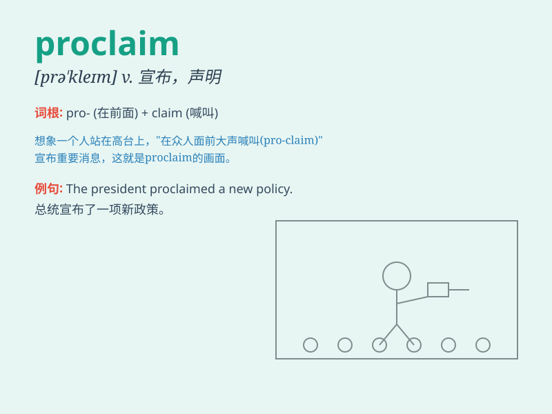

## proclaim

**英音:** _[prə\'kleɪm]_ **美音:** _[prə\'klem]_

**译义:** *vt.宣布,声明,显示,显露*

### 短语

+ **proclaim loudly:** _大声宣告_

+ **proclaim publicly:** _公开宣称_

+ **proclaim officially:** _正式宣布_

+ **proclaim boldly:** _大胆宣告_

+ **proclaim repeatedly:** _反复宣称_

### 例句

#### 例句1

> **The president proclaimed a state of emergency.**

**中文翻译:** 总统宣布进入紧急状态。

**单词释义:** 宣布，宣告

#### 例句2

> **The priest proclaimed the gospel to the congregation.**

**中文翻译:** 牧师向会众宣讲福音。

**单词释义:** 宣讲，宣扬

#### 例句3

> **The sign proclaimed \'No Smoking\'.**

**中文翻译:** 那个标识宣告'禁止吸烟'。

**单词释义:** 宣告，声明

### 背诵小故事

>
国王站在城堡的高处，向他的子民大声宣告（proclaim）战争的胜利。他的声音洪亮而坚定，让所有人都清楚地听到了这个好消息。

**国王在城堡高处向子民大声宣告战争胜利的故事，帮助记忆单词'proclaim'（宣告；声明）**

### 图义

