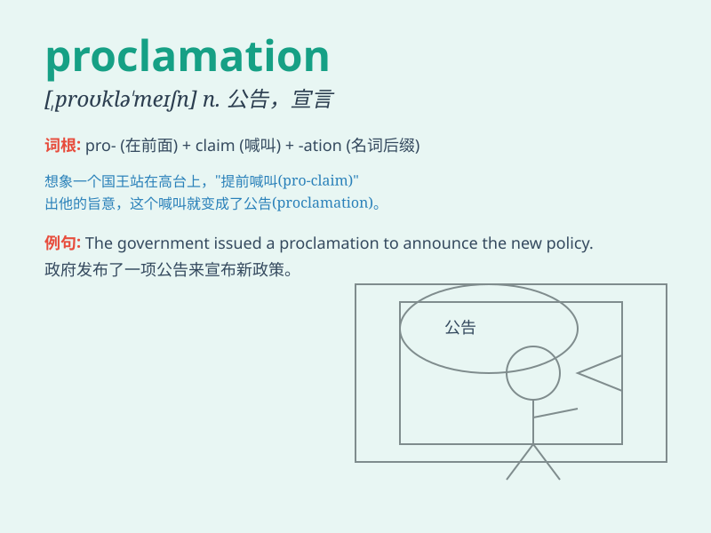

## proclamation

**英音:** _[prɒklə\'meɪʃn]_ **美音:** _[,prɑklə\'meʃən]_

**译义:** *n.宣布*

### 短语

+ **make a proclamation:** _发布公告_

+ **official proclamation:** _官方公告_

+ **royal proclamation:** _王室公告_

+ **emergency proclamation:** _紧急公告_

+ **public proclamation:** _公共公告_

### 例句

#### 例句1

> **The president issued a proclamation of emergency.**

**中文翻译:** 总统发布了紧急状态公告。

**单词释义:** 公告；宣告

#### 例句2

> **The proclamation of the new law caused widespread discussion.**

**中文翻译:** 新法律的公布引起了广泛的讨论。

**单词释义:** 公布；声明

#### 例句3

> **The town crier made a proclamation in the market square.**

**中文翻译:** 城镇公告员在集市广场上发布公告。

**单词释义:** 宣布；宣告

### 背诵小故事

> 国王站在城堡高处，大声宣读
proclamation，宣布全国减税。百姓们欢呼雀跃，因为这个宣告意味着生活将变得更美好。

**国王站在城堡高处，大声宣读 公告
，宣布全国减税。百姓们欢呼雀跃，因为这个 公告
意味着生活将变得更美好。**

### 图义

