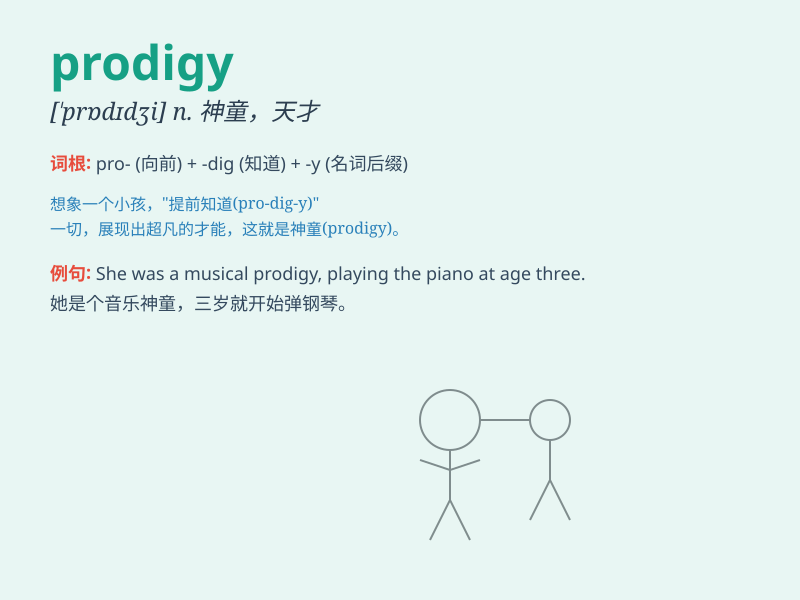

## prodigy

**英音:** _[\'prɒdɪdʒɪ]_ **美音:** _[\'prɑdədʒi]_

**译义:** *n.惊人的事物,天才(特指神童),奇观,奇事*

### 短语

+ **child prodigy:** _神童；天才儿童_

+ **mathematical prodigy:** _数学天才_

+ **musical prodigy:** _音乐天才_

+ **prodigy of nature:** _自然奇观_

+ **prodigy in art:** _艺术奇才_

### 例句

#### 例句1

> **The young pianist is considered a prodigy.**

**中文翻译:** 这位年轻的钢琴家被认为是个天才。

**单词释义:** 天才；奇才

#### 例句2

> **He showed prodigy skills in mathematics at a very young age.**

**中文翻译:** 他在很小的时候就展现出了在数学方面的非凡才能。

**单词释义:** 非凡的才能；惊人的天赋

#### 例句3

> **The child is a prodigy in art, creating masterpieces beyond her
years.**

**中文翻译:** 这个孩子在艺术方面是个神童，创作出了超越其年龄的杰作。

**单词释义:** 神童

### 背诵小故事

> A long time ago, in a small village, there was a child named Lily.
She could solve complex math problems at a very young age. Everyone
called her a prodigy, meaning a young person with extraordinary talent.

**很久以前，在一个小村庄里，有个叫莉莉的孩子。她很小就能解决复杂的数学问题。大家都称她为奇才，prodigy
意思就是极具天赋的年轻人。**

### 图义

