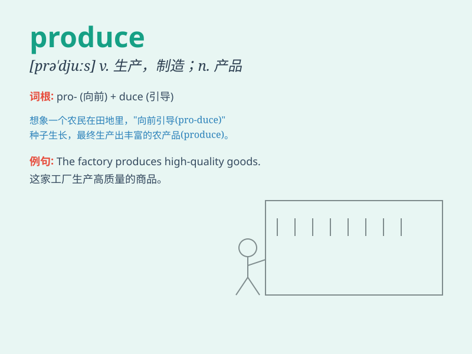

## produce

**英音:** _[prəˈdju:s;(for n.)ˈprɒdju:s]_ **美音:**
_[prəˈdus;(for n.)ˈprɒdus; prɑdus]_

**译义:**
*n.产物,农产品vt.提出,出示,生产,制造,结(果实),引起,招致,创作*

### 短语

+ **produce evidence:** _出示证据_

+ **produce results:** _产生结果_

+ **produce goods:** _生产商品_

+ **local produce:** _当地农产品_

+ **produce electricity:** _发电_

### 例句

#### 例句1

> **The factory produces cars.**

**中文翻译:** 这家工厂生产汽车。

**单词释义:** 生产

#### 例句2

> **The play produced a great effect.**

**中文翻译:** 这部戏产生了很大的影响。

**单词释义:** 产生

#### 例句3

> **She produced a delicious meal from very few ingredients.**

**中文翻译:** 她用很少的食材做出了一顿美味的饭菜。

**单词释义:** 做出

### 背诵小故事

> A farmer works hard every day to produce a lot of fresh fruits and
vegetables. He takes care of the fields, waters the plants, and finally
harvests them to sell in the market. This is how he produces food for
people.

**一位农民每天辛勤劳作以生产出大量新鲜的水果和蔬菜。他照料田地，给植物浇水，最后收获它们并在市场上出售。这就是他为人们生产食物的方式。**

### 图义

