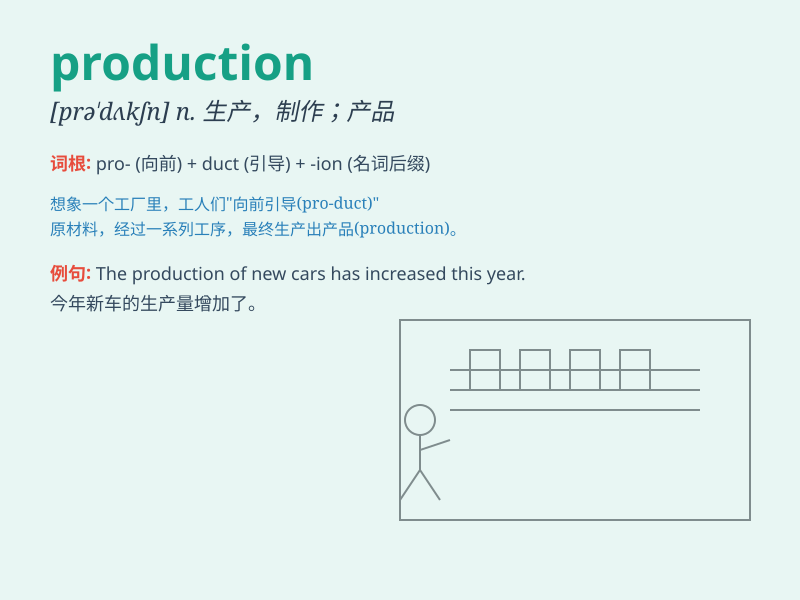

## production

**英音:** _[prə\'dʌkʃ(ə)n]_ **美音:** _[prə\'dʌkʃən]_

**译义:** *n.生产,产品,作品,(研究)成果*

### 短语

+ **production line:** _生产线_

+ **production cost:** _生产成本_

+ **mass production:** _大规模生产_

+ **production capacity:** _生产能力_

+ **production process:** _生产过程_

### 例句

#### 例句1

> **The production of this new car model has started.**

**中文翻译:** 这种新车型的生产已经开始了。

**单词释义:** 生产；制造

#### 例句2

> **The play was a great success in terms of production.**

**中文翻译:** 就制作而言，这部戏非常成功。

**单词释义:** 制作

#### 例句3

> **Oil production has been increasing steadily.**

**中文翻译:** 石油产量一直在稳步增长。

**单词释义:** 产量

### 背诵小故事

> A factory was in a race to increase its production. Workers worked
hard day and night. Finally, they made more products than ever before.
Success! Now you know \'production\' means the process of making or
growing things.

**一家工厂在竞赛提高其产量。工人们日夜努力工作。最终，他们生产出了比以往更多的产品。成功！现在你知道'production'意思是制造或种植东西的过程。**

### 图义

