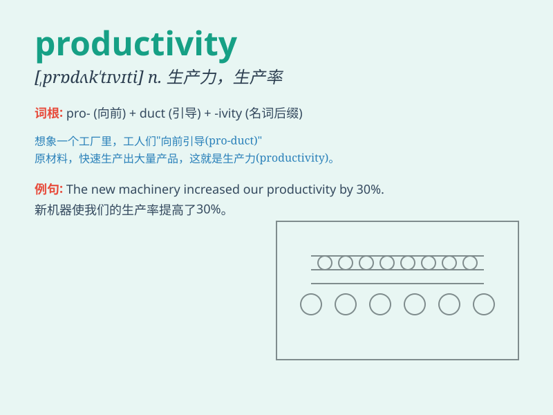

## productivity

**英音:** _[prɒdʌk\'tɪvɪtɪ]_ **美音:**
_[,prodʌk\'tɪvəti]_

**译义:** *n.生产力*

### 短语

+ **increase productivity:** _提高生产力_

+ **productivity growth:** _生产力增长_

+ **labour productivity:** _劳动生产率_

+ **productivity improvement:** _生产力改进_

+ **productivity decline:** _生产力下降_

### 例句

#### 例句1

> **The new technology has greatly increased productivity in the
factory.**

**中文翻译:** 这项新技术极大地提高了工厂的生产率。

**单词释义:** 生产率；生产效率

#### 例句2

> **We need to improve productivity to meet the growing demand.**

**中文翻译:** 我们需要提高生产力以满足不断增长的需求。

**单词释义:** 生产力；生产效率

#### 例句3

> **Low productivity is a major concern for many businesses.**

**中文翻译:** 低生产率是许多企业的主要担忧。

**单词释义:** 生产率；生产效率

### 背诵小故事

> A factory was in trouble due to low productivity. The workers were
tired and machines were old. Then a smart manager came. He trained the
workers and upgraded the machines. Productivity soared!

**一家工厂因生产力低下陷入困境。工人们疲惫，机器老旧。后来一位聪明的经理来了，他培训工人并升级机器。生产力大幅提升！**

### 图义

