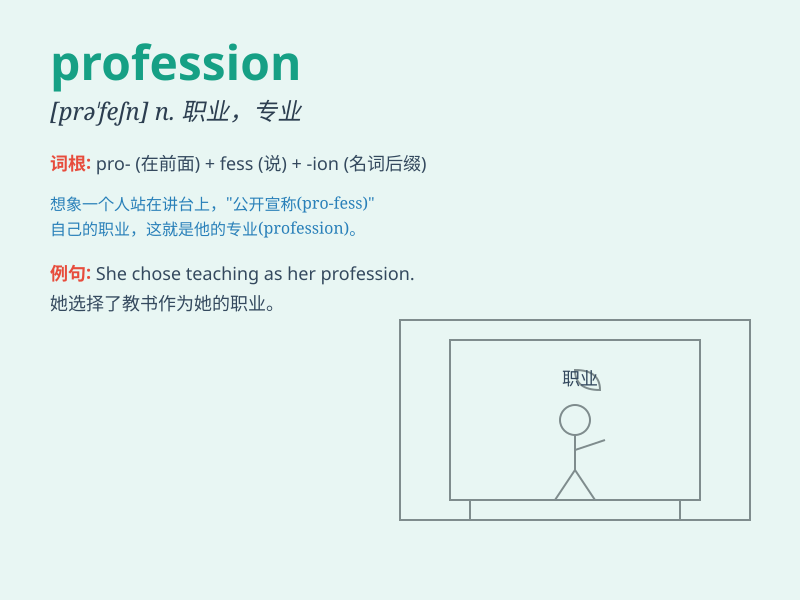

## profession

**英音:** _[prə\'feʃ(ə)n]_ **美音:** _[prə\'fɛʃən]_

**译义:** *n.职业,专业,表白,宣布*

### 短语

+ **professional career:** _职业生涯_

+ **medical profession:** _医疗行业_

+ **legal profession:** _法律行业_

+ **teaching profession:** _教育行业_

+ **enter a profession:** _进入一个行业_

### 例句

#### 例句1

> **She chose teaching as her profession.**

**中文翻译:** 她选择教书作为她的职业。

**单词释义:** 职业

#### 例句2

> **The legal profession attracts many bright students.**

**中文翻译:** 法律行业吸引了很多聪明的学生。

**单词释义:** 行业

#### 例句3

> **He\'s well-respected in his profession.**

**中文翻译:** 他在他的职业中备受尊敬。

**单词释义:** 职业

### 背诵小故事

> A young man was confused about his future. One day, he met a wise old
man. The old man said, \'Find your profession that you love, like being
a doctor or a teacher.\' The young man understood and started to search
for his true profession.

**一个年轻人对自己的未来感到迷茫。有一天，他遇到了一位智慧的老人。老人说：\'找到你热爱的职业，比如当医生或者老师。\'年轻人明白了，开始寻找自己真正的职业。**

### 图义

