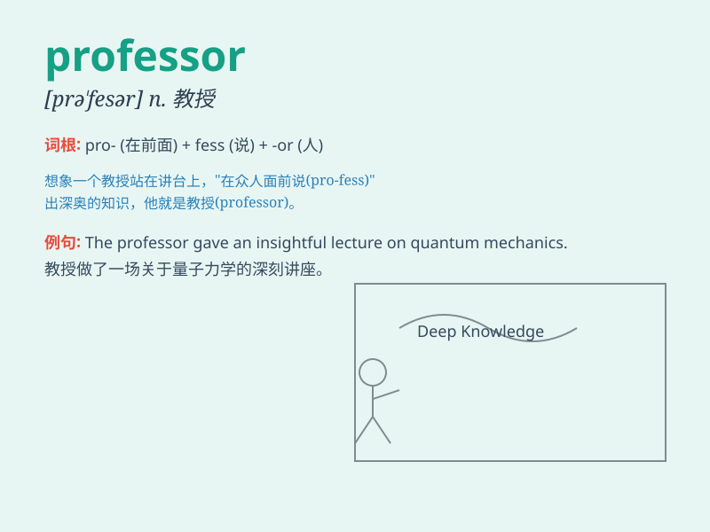

## professor

**英音:** _[prə\'fesə]_ **美音:** _[prə\'fɛsɚ]_

**译义:** *n.教授,公开表示信仰的人*

### 短语

+ **associate professor:** _副教授_

+ **visiting professor:** _客座教授_

+ **professor emeritus:** _荣誉教授；退休教授_

+ **full professor:** _正教授_

+ **adjunct professor:** _兼职教授_

### 例句

#### 例句1

> **The professor gave an inspiring lecture on quantum physics.**

**中文翻译:** 这位教授做了一场关于量子物理学的鼓舞人心的讲座。

**单词释义:** 教授

#### 例句2

> **She was invited to be a visiting professor at the prestigious
university.**

**中文翻译:** 她受邀在这所著名的大学担任客座教授。

**单词释义:** 教授

#### 例句3

> **The professor is conducting research in the field of artificial
intelligence.**

**中文翻译:** 这位教授正在人工智能领域进行研究。

**单词释义:** 教授

### 背诵小故事

> A professor was giving a lecture. Suddenly, a student asked a
difficult question. The professor thought hard and finally gave a
brilliant answer. Everyone admired the professor\'s wisdom and
knowledge.

**一位教授正在授课。突然，一名学生提出了一个难题。教授努力思考，最终给出了一个精彩的答案。每个人都钦佩教授的智慧和知识。**

### 图义

