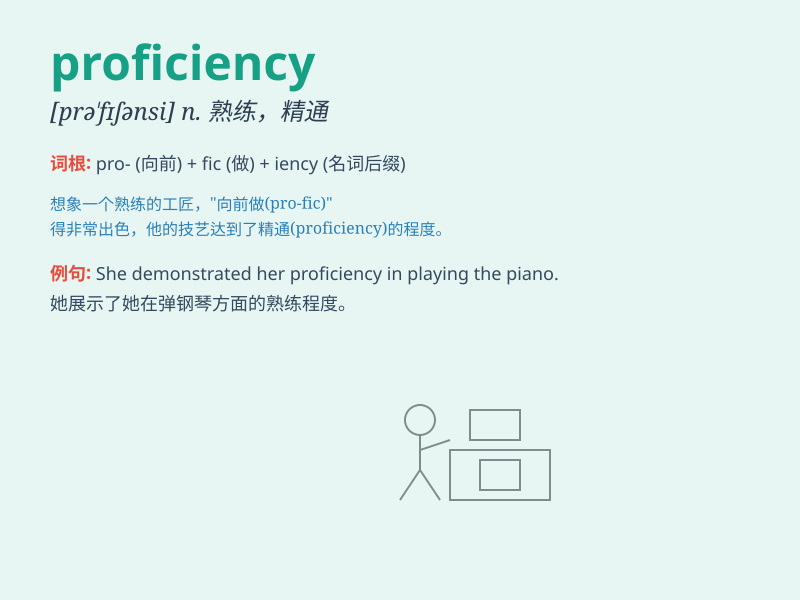

## proficiency

**英音:** _[prə\'fɪʃ(ə)nsɪ]_ **美音:** _[prə\'fɪʃənsi]_

**译义:** *n.熟练,精通,熟练程度*

### 短语

+ **language proficiency:** _语言能力_

+ **proficiency test:** _水平测试_

+ **proficiency level:** _熟练程度_

+ **academic proficiency:** _学业水平_

+ **professional proficiency:** _专业技能_

### 例句

#### 例句1

> **She has achieved a high level of proficiency in French.**

**中文翻译:** 她在法语方面达到了很高的熟练程度。

**单词释义:** 熟练程度

#### 例句2

> **His proficiency in playing the guitar impressed everyone.**

**中文翻译:** 他弹吉他的熟练程度给每个人都留下了深刻的印象。

**单词释义:** 熟练程度

#### 例句3

> **To gain proficiency in a new language requires consistent
practice.**

**中文翻译:** 要在一门新语言上达到熟练需要持续的练习。

**单词释义:** 熟练

### 背诵小故事

> A young student dreamed of achieving proficiency in playing the
piano. Every day, she practiced hard. Finally, her performance was
perfect. Proficiency means a high level of skill or expertise.

**一个年轻的学生梦想在弹钢琴方面达到精通。她每天都努力练习。最终，她的表演完美无缺。proficiency
意思是高水平的技能或专长。**

### 图义

