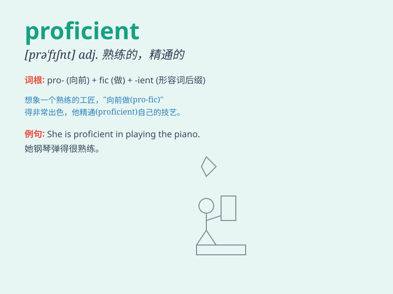

## proficient

**英音:** _[prə\'fɪʃ(ə)nt]_ **美音:** _[prə\'fɪʃnt]_

**译义:** *n.精通*

### 短语

+ **be proficient in:** _在\...\...方面熟练；精通\...\..._

+ **proficient level:** _熟练水平_

+ **become proficient:** _变得熟练_

+ **proficient skills:** _熟练的技能_

+ **highly proficient:** _高度熟练_

### 例句

#### 例句1

> **She is proficient in playing the piano.**

**中文翻译:** 她精通弹钢琴。

**单词释义:** 精通

#### 例句2

> **He has become proficient in Spanish after years of study.**

**中文翻译:** 经过多年的学习，他已经熟练掌握了西班牙语。

**单词释义:** 熟练掌握

#### 例句3

> **The workers are proficient at operating the new machinery.**

**中文翻译:** 工人们熟练操作新机器。

**单词释义:** 熟练

### 背诵小故事

> A young artist was not proficient in painting at first. But through
years of practice, day and night, he finally became highly skilled and
proficient. Now his works are loved by everyone.

**一位年轻的艺术家起初绘画并不熟练。但经过多年日夜的练习，他最终变得技艺高超且熟练。现在他的作品深受大家喜爱。**

### 图义

