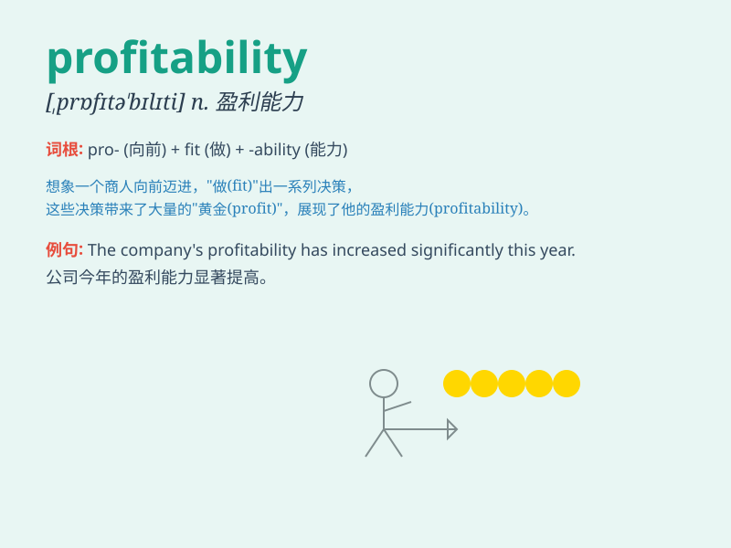

## profitability

**英音:** _[ˌprɒfɪtəˈbɪlɪti]_ **美音:**
_[ˌprɑfɪtəˈbɪlɪti]_

**译义:** *n.收益性,利益率*

### 短语

+ **improve profitability:** _提高盈利能力_

+ **assess profitability:** _评估盈利能力_

+ **enhance profitability:** _增强盈利能力_

+ **analyze profitability:** _分析盈利能力_

+ **maximize profitability:** _使盈利能力最大化_

### 例句

#### 例句1

> **The company\'s profitability has improved significantly this
year.**

**中文翻译:** 这家公司今年的盈利能力有了显著提高。

**单词释义:** 盈利能力

#### 例句2

> **We need to analyze the profitability of this new project
carefully.**

**中文翻译:** 我们需要仔细分析这个新项目的盈利能力。

**单词释义:** 盈利能力

#### 例句3

> **The low profitability of the business forced them to make some
changes.**

**中文翻译:** 生意的低盈利能力迫使他们做出一些改变。

**单词释义:** 盈利能力

### 背诵小故事

> A young entrepreneur struggled to make his business succeed. After
many trials, he found the right strategies and his company\'s
profitability soared. He realized that smart decisions led to greater
profits and long-term success.

**一位年轻的企业家努力使他的企业获得成功。经过多次尝试，他找到了正确的策略，他公司的盈利能力飙升。他意识到明智的决策会带来更大的利润和长期的成功。**

### 图义

