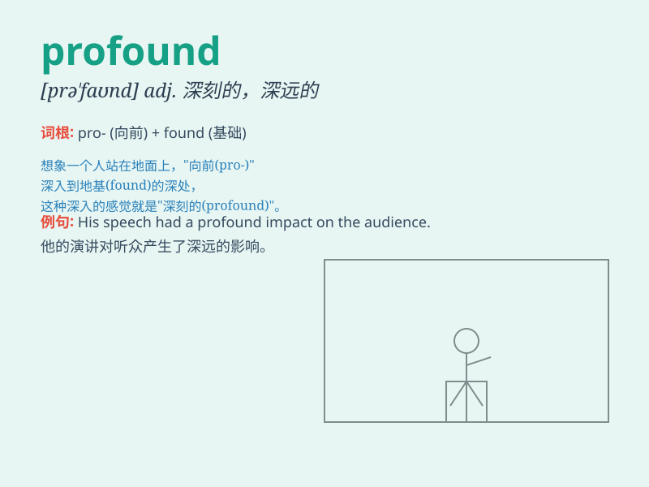

## profound

**英音:** _[prə\'faʊnd]_ **美音:** _[prə\'faʊnd]_

**译义:** *adj.深刻的,意义深远的,渊博的,造诣深的*

### 短语

+ **profound impact:** _深远的影响_

+ **profound knowledge:** _渊博的知识_

+ **profound thought:** _深刻的思想_

+ **profound change:** _深刻的变化_

+ **profound meaning:** _深刻的意义_

### 例句

#### 例句1

> **His speech had a profound impact on the audience.**

**中文翻译:** 他的演讲对观众产生了深远的影响。

**单词释义:** 深远的

#### 例句2

> **She has a profound understanding of literature.**

**中文翻译:** 她对文学有深刻的理解。

**单词释义:** 深刻的

#### 例句3

> **The book offers profound insights into human nature.**

**中文翻译:** 这本书对人性提供了深刻的见解。

**单词释义:** 深刻的；深邃的

### 背诵小故事

> A wise old man had profound knowledge. He could solve any difficult
problem. One day, a young man asked him for advice. The old man\'s
profound words changed the young man\'s life forever.

**一位智慧的老人有着渊博的知识。他能解决任何难题。一天，一个年轻人向他请教。老人深刻的话语永远改变了年轻人的生活。**

### 图义

