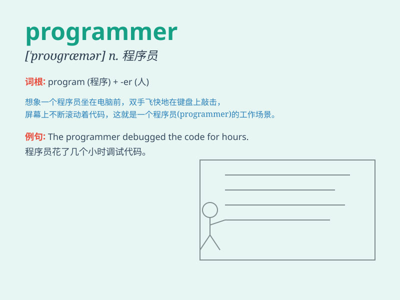

## programmer

**英音:** _[\'prəʊgræmə]_ **美音:** _[\'progræmɚ]_

**译义:** *n.程序师,程序规划员*

### 短语

+ **computer programmer:** _计算机程序员_

+ **software programmer:** _软件程序员_

+ **experienced programmer:** _经验丰富的程序员_

+ **junior programmer:** _初级程序员_

+ **senior programmer:** _高级程序员_

### 例句

#### 例句1

> **The programmer is working on a complex software project.**

**中文翻译:** 这位程序员正在从事一个复杂的软件项目。

**单词释义:** 程序员

#### 例句2

> **She dreams of becoming a successful programmer in the future.**

**中文翻译:** 她梦想将来成为一名成功的程序员。

**单词释义:** 程序员

#### 例句3

> **Our company hired several experienced programmers to improve the
system.**

**中文翻译:** 我们公司雇用了几位经验丰富的程序员来改进系统。

**单词释义:** 程序员

### 背诵小故事

>
想象一个神奇的世界，在那里，有个叫小明的人，他每天都在电脑前敲敲打打，编写着各种神奇的代码，就像魔法师施展魔法一样。小明就是一个
programmer，专门创造各种程序的人。

**想象一个神奇的场景，其中有个叫小明的人，他每天在电脑前编写各种代码，像魔法师施展魔法。小明就是程序员，专门开发程序的人。**

### 图义

