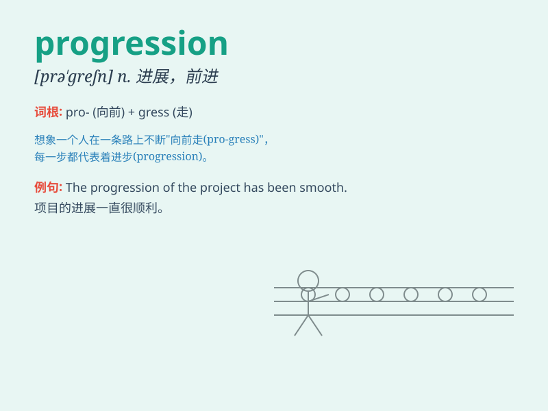

## progression

**英音:** _[prə\'greʃ(ə)n]_ **美音:** _[prə\'ɡrɛʃən]_

**译义:** *n.行进,级数*

### 短语

+ **linear progression:** _线性进展_

+ **career progression:** _职业发展_

+ **progression of disease:** _疾病的进展_

+ **natural progression:** _自然发展_

+ **progression rate:** _进展速度_

### 例句

#### 例句1

> **The progression of the disease was rapid.**

**中文翻译:** 这种疾病的发展很迅速。

**单词释义:** （疾病等的）发展；进展

#### 例句2

> **The company has made significant progressions in technology
research.**

**中文翻译:** 这家公司在技术研究方面取得了重大进展。

**单词释义:** 进步；进展

#### 例句3

> **The progression of the seasons is a natural phenomenon.**

**中文翻译:** 季节的更替是一种自然现象。

**单词释义:** （季节等的）更替；演变

### 背诵小故事

> A brave knight was on a journey. Every step he took was a part of his
progression. He faced many challenges but never stopped moving forward.
Finally, he reached his destination, achieving great success.

**一位勇敢的骑士在旅途中。他走的每一步都是他前进的一部分。他面临许多挑战，但从未停止前进。最终，他到达了目的地，取得了巨大的成功。**

### 图义

