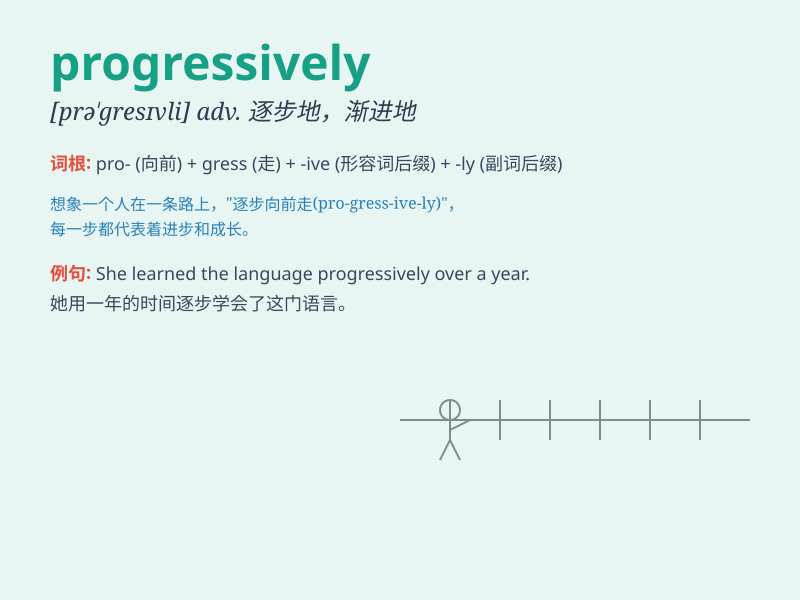

## progressively

**英音:** _[prəˈgresɪvli]_ **美音:** _[prə\'ɡrɛsɪvli]_

**译义:** *adv.日益增多地*

### 短语

+ **progressively difficult:** _逐渐困难_

+ **progressively better:** _逐渐变好_

+ **progressively increase:** _逐步增加_

+ **progressively develop:** _逐步发展_

+ **progressively improve:** _逐步改善_

### 例句

#### 例句1

> **The disease progresses progressively, making it harder to
treat.**

**中文翻译:** 这种疾病逐渐地发展，使得治疗更加困难。

**单词释义:** 逐渐地

#### 例句2

> **The company is progressively expanding its business overseas.**

**中文翻译:** 这家公司正在逐步向海外拓展业务。

**单词释义:** 逐步地

#### 例句3

> **The weather is getting worse progressively as the day goes
on.**

**中文翻译:** 随着时间的推移，天气逐渐变得更糟。

**单词释义:** 逐渐地

### 背诵小故事

> A little ant was climbing a mountain. It moved progressively, step by
step. It never gave up and finally reached the top. Progressively means
moving forward steadily and gradually.

**一只小蚂蚁正在爬山。它逐步地前进，一步一步。它从不放弃，最终到达了山顶。Progressively
意思是稳定地、逐步地前进。**

### 图义

