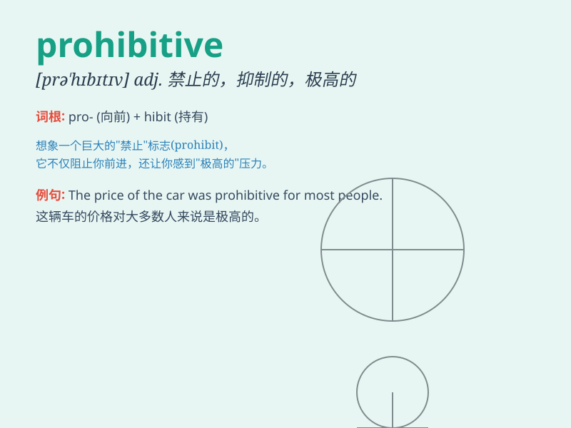

## prohibitive

**英音:** _[prə(ʊ)\'hɪbɪtɪv]_ **美音:** _[prə\'hɪbətɪv]_

**译义:** *adj.禁止的,抑制的*

### 短语

+ **prohibitive cost:** _过高的成本_

+ **prohibitive measure:** _禁止性措施_

+ **prohibitive tariff:** _禁止性关税_

+ **prohibitive price:** _高得令人望而却步的价格_

+ **prohibitive law:** _禁止性法律_

### 例句

#### 例句1

> **The cost of the new car is prohibitive.**

**中文翻译:** 这辆新车的价格高得令人望而却步。

**单词释义:** 高得让人难以承受的

#### 例句2

> **The regulations are prohibitive for small businesses.**

**中文翻译:** 这些规定对于小企业来说是难以承受的。

**单词释义:** 难以承受的；禁止性的

#### 例句3

> **The high rent in the city is prohibitive for many young
people.**

**中文翻译:** 城市里高昂的租金对许多年轻人来说是无法承受的。

**单词释义:** 使人望而却步的；负担不起的

### 背诵小故事

> A poor student wanted to buy a luxury car, but the price was
prohibitive. It was so high that it prevented him from even considering
the purchase. He had to give up his dream.

**一个贫困的学生想买一辆豪车，但价格高得令人望而却步。价格实在太高，以至于让他连购买的想法都无法产生。他不得不放弃梦想。**

### 图义

