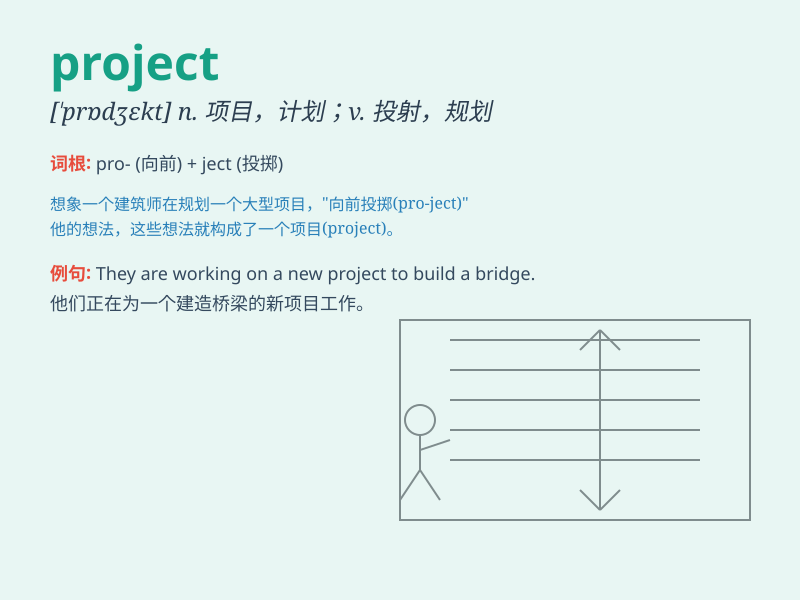

## project

**英音:** _[prəˈdʒekt; ˈprɒdʒekt]_ **美音:** _[prəˈdʒɛkt;
prɑdʒɛkt]_

**译义:**
*n.计划,方案,事业,企业,工程v.设计,计划,投射,放映,射出,发射(导弹等),凸出*

### 短语

+ **project manager:** _项目经理_

+ **research project:** _研究项目_

+ **project plan:** _项目计划_

+ **project budget:** _项目预算_

+ **project team:** _项目团队_

### 例句

#### 例句1

> **The company is working on a new project to develop a
revolutionary product.**

**中文翻译:** 这家公司正在进行一个新的项目，以开发一款革命性的产品。

**单词释义:** 项目

#### 例句2

> **She projected her voice to be heard at the back of the room.**

**中文翻译:** 她提高嗓音以便让房间后面的人也能听到。

**单词释义:** 投射；使突出

#### 例句3

> **The economic situation projects a gloomy outlook for the next
year.**

**中文翻译:** 经济形势预示着明年的前景暗淡。

**单词释义:** 预测；预计

### 背诵小故事

>
想象一下，你有一个超级棒的想法，要建一座魔法城堡。你把这个想法详细地写下来、画出来，这就是一个\'project\'（计划、项目）。你努力去实现它，让城堡从想象变成现实。

**想象通过建魔法城堡来理解\'project\'这个单词，表示计划、项目的意思。**

### 图义

