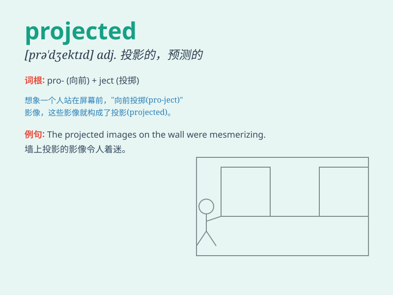

## projected

**英音:** _[prəˈdʒektɪd]_ **美音:** _[prəˈdʒɛktɪd]_

**译义:**
*adj.计划中的；预期的；投影的；n.工程，项目（project的过去分词）*

### 短语

+ **projected cost:** _预计成本_

+ **projected image:** _投影图像_

+ **projected growth:** _预计增长_

+ **projected sales:** _预计销售额_

+ **projected outcome:** _预计结果_

### 例句

#### 例句1

> **The company\'s projected profits for the next year are very
encouraging.**

**中文翻译:** 公司明年的预计利润非常令人鼓舞。

**单词释义:** 预计的

#### 例句2

> **The projected growth rate of the economy has been revised
downward.**

**中文翻译:** 经济的预计增长率已被向下修正。

**单词释义:** 预计的；预期的

#### 例句3

> **The building\'s projected completion date is at the end of this
month.**

**中文翻译:** 这座大楼的预计竣工日期是本月底。

**单词释义:** 预计的

### 背诵小故事

> A brave astronaut was projected into space. He faced many challenges
but was determined to complete his mission. The word \'projected\' here
means sent or thrown forward forcefully.

**一位勇敢的宇航员被投射到太空中。他面临许多挑战，但决心完成任务。单词\'projected\'在这里表示有力地发送或向前投掷。**

### 图义

