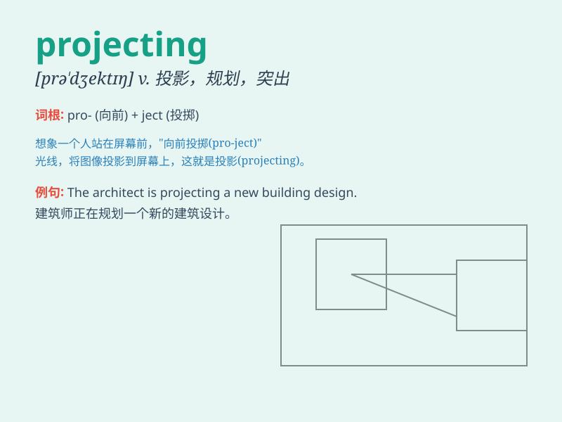

## projecting

**英音:** _[prəˈdʒektɪŋ]_ **美音:** _[prəˈdʒektɪŋ]_

**译义:** *adj.突出的,伸出的*

### 短语

+ **projecting beam:** _突出的梁_

+ **projecting part:** _突出部分_

+ **projecting roof:** _伸出的屋顶_

+ **projecting ledge:** _突出的壁架_

+ **projecting balcony:** _突出的阳台_

### 例句

#### 例句1

> **The balcony has a projecting ledge.**

**中文翻译:** 阳台有一个突出的壁架。

**单词释义:** 突出的；伸出的

#### 例句2

> **The castle has several projecting towers.**

**中文翻译:** 这座城堡有几座突出的塔楼。

**单词释义:** 突出的；伸出的

#### 例句3

> **He was sitting on a projecting rock.**

**中文翻译:** 他坐在一块突出的岩石上。

**单词释义:** 突出的；伸出的

### 背诵小故事

> A brave architect was standing on a cliff, imagining a building
projecting out from it. The design was so unique that it would stand
out. He kept visualizing the projecting part, determined to make it a
reality.

**一位勇敢的建筑师站在悬崖边，想象着一座建筑物从那里向外突出。这个设计非常独特，会很显眼。他一直想象着突出的部分，决心将其变为现实。**

### 图义

