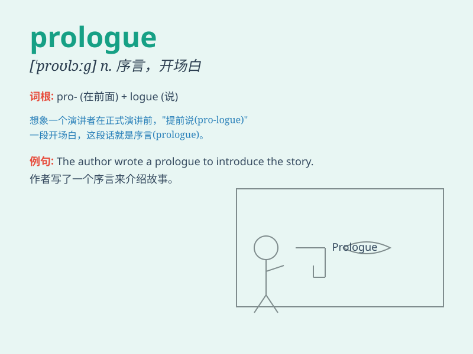

## prologue

**英音:** _[\'prəʊlɒg]_ **美音:** _[\'prolɔɡ]_

**译义:** *n.序言*

### 短语

+ **write a prologue:** _写一个序言_

+ **the prologue of a novel:** _一部小说的序言_

+ **prologue section:** _序言部分_

+ **long prologue:** _冗长的序言_

+ **short prologue:** _简短的序言_

### 例句

#### 例句1

> **The prologue of the novel sets the scene for the entire
story.**

**中文翻译:** 这部小说的序言为整个故事设定了场景。

**单词释义:** 序言；开场白

#### 例句2

> **The prologue to the play was very engaging and drew the audience
in.**

**中文翻译:** 这部戏剧的序幕非常吸引人，把观众吸引了进来。

**单词释义:** 序幕；开场

#### 例句3

> **The prologue provided some background information that helped us
understand the main plot.**

**中文翻译:** 序言提供了一些背景信息，帮助我们理解主要情节。

**单词释义:** 序言；引言

### 背诵小故事

> A famous author was about to release a new book. Before the main
story began, there was a prologue that introduced the background and set
the stage. It was like a key that unlocked the door to the wonderful
world of the story.

**一位著名的作家即将发布一本新书。在主要故事开始之前，有一个序言介绍了背景并搭建了舞台。它就像一把打开故事精彩世界之门的钥匙。**

### 图义

