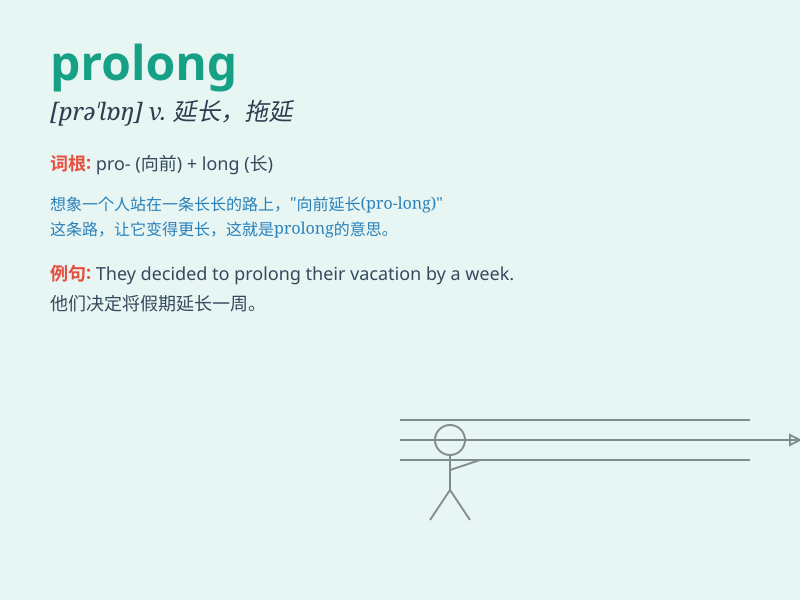

## prolong

**英音:** _[prə\'lɒŋ]_ **美音:** _[prəˈlɑːŋ]_

**译义:** *vt.延长,拖延*

### 短语

+ **prolong the deadline:** _延长截止日期_

+ **prolong the meeting:** _延长会议_

+ **prolong life:** _延长生命_

+ **prolong the conversation:** _延长谈话_

+ **prolong the journey:** _延长旅程_

### 例句

#### 例句1

> **The meeting was prolonged for another hour.**

**中文翻译:** 会议被延长了一个小时。

**单词释义:** 延长

#### 例句2

> **She tried to prolong the conversation.**

**中文翻译:** 她试图延长谈话。

**单词释义:** 延长

#### 例句3

> **The medicine can prolong the patient\'s life.**

**中文翻译:** 这种药可以延长病人的生命。

**单词释义:** 延长

### 背诵小故事

> A king wanted to prolong his reign. So, he sought a magic potion.
\'Pro\' means forward and \'long\' means length. Just like the king
trying to extend the length of his rule, \'prolong\' means to extend the
duration of something.

**一位国王想要延长他的统治。所以，他寻找一种神奇的药水。\'pro\'表示向前，\'long\'表示长度。就像国王试图延长他的统治时长一样，\'prolong\'意思是延长某物的持续时间。**

### 图义

