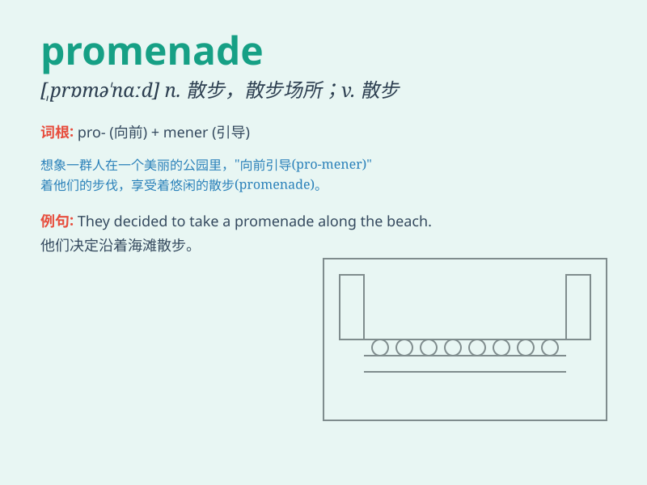

## promenade

**英音:** _[,prɒmə\'nɑːd; -\'neɪd; \'prɒm-]_ **美音:**
_[,prɑmə\'ned]_

**译义:** *n.散步v.散步adj.散步的*

### 短语

+ **promenade deck:** _散步甲板_

+ **promenade concert:** _逍遥音乐会_

+ **take a promenade:** _散步；漫步_

+ **promenade dress:** _散步裙；晚礼服裙_

+ **promenade along the beach:** _沿着海滩漫步_

### 例句

#### 例句1

> **We took a promenade along the beach at sunset.**

**中文翻译:** 我们在日落时沿着海滩散步。

**单词释义:** 散步；漫步

#### 例句2

> **The promenade in the park is always crowded on weekends.**

**中文翻译:** 公园里的散步道在周末总是很拥挤。

**单词释义:** 散步道；人行道

#### 例句3

> **They were seen promenading through the town in their finest
clothes.**

**中文翻译:** 有人看到他们穿着最漂亮的衣服在镇上闲逛。

**单词释义:** 闲逛；溜达

### 背诵小故事

> A couple went for a promenade along the beach. They held hands,
enjoying the gentle sea breeze and beautiful sunset. The walk was so
relaxing and romantic.

**一对情侣沿着海滩散步。他们手牵着手，享受着轻柔的海风和美丽的日落。这次漫步是如此的放松和浪漫。**

### 图义

