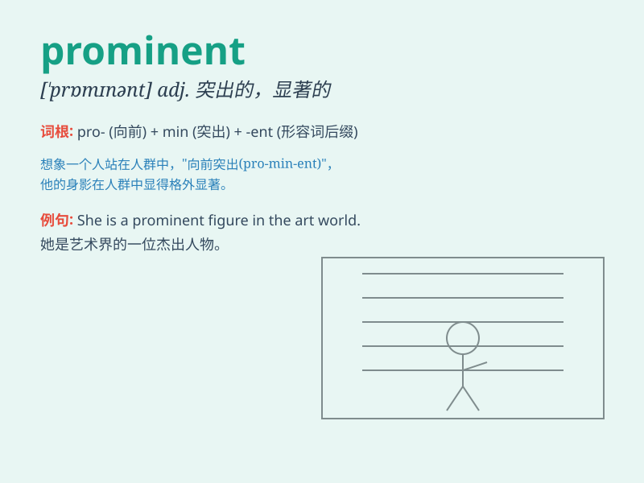

## prominent

**英音:** _[\'prɒmɪnənt]_ **美音:** _[\'prɑmɪnənt]_

**译义:** *adj.卓越的,显著的,突出的*

### 短语

+ **prominent figure:** _杰出人物；重要人物_

+ **prominent feature:** _显著特征；突出特点_

+ **prominent position:** _显要位置；重要职位_

+ **prominent role:** _重要角色；突出作用_

+ **prominent among:** _在......中突出_

### 例句

#### 例句1

> **He is a prominent scientist in the field of physics.**

**中文翻译:** 他是物理学领域的杰出科学家。

**单词释义:** 杰出的；卓越的

#### 例句2

> **The church tower was a prominent landmark in the town.**

**中文翻译:** 教堂的尖塔是这个城镇的显著地标。

**单词释义:** 显著的；突出的

#### 例句3

> **She has a prominent nose.**

**中文翻译:** 她有一个高挺的鼻子。

**单词释义:** 突出的；凸出的

### 背诵小故事

> A young artist worked hard and his paintings became prominent.
Everyone in the city knew his works. His name was on the lips of art
lovers. Finally, he got a big award and became really famous.

**一位年轻的艺术家努力创作，他的画作变得杰出。城市里的每个人都知道他的作品。艺术爱好者们都在谈论他。最后，他获得了一个大奖，变得非常出名。**

### 图义

