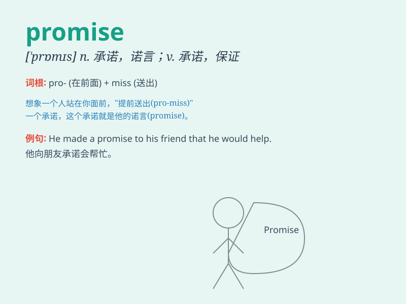

## promise

**英音:** _[\'prɒmɪs]_ **美音:** _[\'prɑmɪs]_

**译义:** *vt.允诺,答应n.允诺,答应,许诺*

### 短语

+ **make a promise:** _许下诺言_

+ **keep a promise:** _信守诺言_

+ **break a promise:** _违背诺言_

+ **promise to do sth.:** _承诺做某事_

+ **show promise:** _有前途；有希望_

### 例句

#### 例句1

> **He made a promise to come early.**

**中文翻译:** 他承诺会早点来。

**单词释义:** 承诺

#### 例句2

> **I promise I won\'t tell anyone.**

**中文翻译:** 我保证我不会告诉任何人。

**单词释义:** 保证

#### 例句3

> **The clear sky promises a fine day.**

**中文翻译:** 晴朗的天空预示着一个好天气。

**单词释义:** 预示

### 背诵小故事

> A little boy promised his mother that he would clean his room. But he
was too tired and wanted to give up. Finally, with determination, he
kept his promise and made the room tidy.

**一个小男孩向他妈妈承诺他会打扫自己的房间。但他太累了想放弃。最后，靠着决心，他信守了承诺，把房间收拾整齐了。**

### 图义

