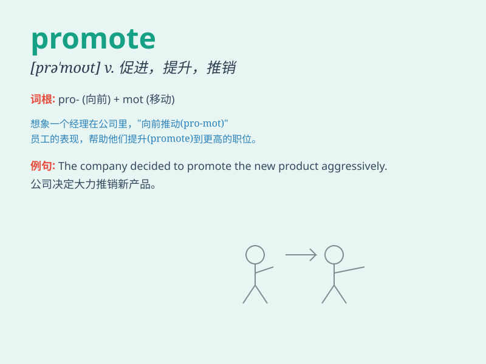

## promote

**英音:** _[prə\'məʊt]_ **美音:** _[prə\'mot]_

**译义:** *vt.促进,发扬,提升,提拔,晋升为 /n.升级/降级*

### 短语

+ **promote sales:** _促销_

+ **promote growth:** _促进增长_

+ **promote understanding:** _增进理解_

+ **promote harmony:** _促进和谐_

+ **promote health:** _促进健康_

### 例句

#### 例句1

> **The company is promoting a new product this month.**

**中文翻译:** 这个公司本月正在推广一款新产品。

**单词释义:** 推广；促销

#### 例句2

> **She was promoted to manager after years of hard work.**

**中文翻译:** 经过多年的努力工作，她被提升为经理。

**单词释义:** 晋升；升职

#### 例句3

> **Exercise promotes good health.**

**中文翻译:** 锻炼促进健康。

**单词释义:** 促进；推动

### 背诵小故事

> A hardworking employee was always passionate about his job. His
excellent performance and innovative ideas promoted him to a managerial
position. Now he can promote better working conditions for the team.

**一位勤奋的员工一直对工作充满热情。他出色的表现和创新的想法使他晋升到了管理职位。现在他能够为团队推动更好的工作条件。**

### 图义

