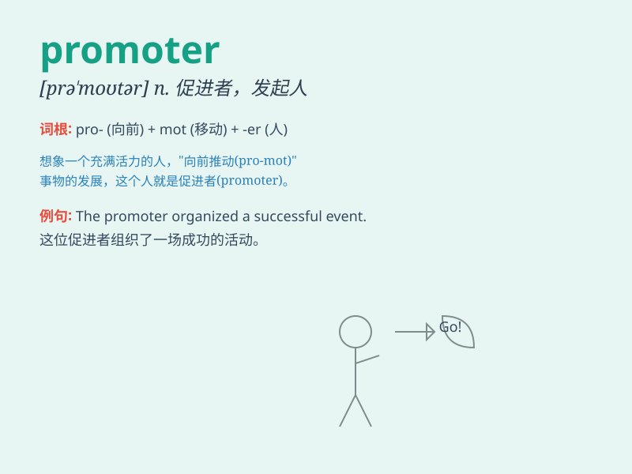

## promoter

**英音:** _[prə\'məʊtə]_ **美音:** _[prə\'motɚ]_

**译义:** *n.促进者,助长者*

### 短语

+ **gene promoter:** _基因启动子_

+ **promoter region:** _启动子区域_

+ **event promoter:** _活动发起人_

+ **music promoter:** _音乐推广人_

+ **business promoter:** _商业促进者_

### 例句

#### 例句1

> **The promoter organized a huge music festival.**

**中文翻译:** 这位发起人组织了一场盛大的音乐节。

**单词释义:** 发起人；主办者

#### 例句2

> **The new drug requires an effective promoter to increase its
sales.**

**中文翻译:** 这种新药需要一个有效的推广者来增加其销量。

**单词释义:** 推广者；促进者

#### 例句3

> **He is a well-known promoter of local sports events.**

**中文翻译:** 他是当地体育赛事的著名倡导者。

**单词释义:** 倡导者

### 背诵小故事

> A young entrepreneur was the promoter of a new tech startup. He
worked tirelessly to promote the idea, organizing events and giving
passionate speeches. Eventually, his efforts paid off and the startup
became a huge success.

**一位年轻的企业家是一家新科技创业公司的发起者。他不知疲倦地工作来推广这个想法，组织活动并发表充满激情的演讲。最终，他的努力得到了回报，创业公司取得了巨大的成功。**

### 图义

