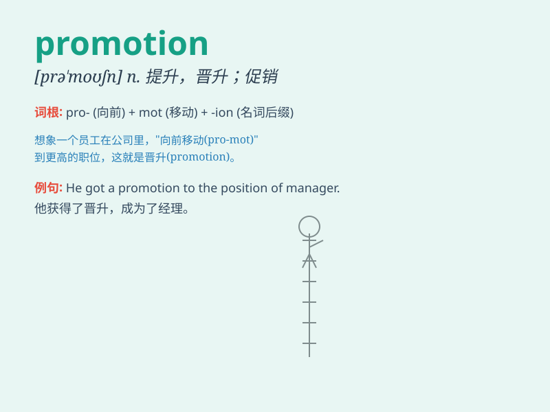

## promotion

**英音:** _[prə\'məʊʃn]_ **美音:** _[prə\'moʃən]_

**译义:** *n.促进,发扬,提升,提拔,晋升*

### 短语

+ **sales promotion:** _促销活动_

+ **job promotion:** _工作晋升_

+ **promotion campaign:** _推广活动_

+ **product promotion:** _产品推广_

+ **promotion opportunity:** _晋升机会_

### 例句

#### 例句1

> **She got a promotion at work after years of hard effort.**

**中文翻译:** 经过多年的努力工作，她在工作中得到了晋升。

**单词释义:** 晋升；升职

#### 例句2

> **The promotion of this new product requires a lot of marketing
strategies.**

**中文翻译:** 这款新产品的推广需要很多营销策略。

**单词释义:** 推广；促进

#### 例句3

> **The football club\'s promotion to the higher league was a great
success.**

**中文翻译:** 这个足球俱乐部晋升到更高级别的联赛是一个巨大的成功。

**单词释义:** 晋升；升级

### 背诵小故事

> A hardworking employee, Tom, always did excellent work. His boss
noticed and gave him a promotion. With this promotion, Tom got a higher
position and more salary. It was a great success for him.

**一位勤奋的员工汤姆，工作一直出色。他的老板注意到了并给他升职。通过这次升职，汤姆获得了更高的职位和更多的薪水。这对他来说是巨大的成功。**

### 图义

