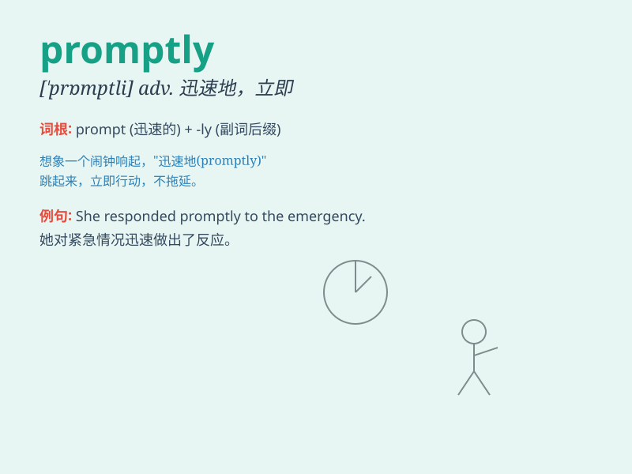

## promptly

**英音:** _[\'prɒm(p)tlɪ]_ **美音:** _[\'prɑmptli]_

**译义:** *adv.敏捷地,迅速地*

### 短语

+ **respond promptly:** _迅速回应_

+ **act promptly:** _迅速行动_

+ **arrive promptly:** _准时到达_

+ **deal with promptly:** _迅速处理_

+ **finish promptly:** _迅速完成_

### 例句

#### 例句1

> **He replied promptly to my email.**

**中文翻译:** 他迅速回复了我的电子邮件。

**单词释义:** 迅速地

#### 例句2

> **The doctor came promptly when called.**

**中文翻译:** 医生一叫就马上来了。

**单词释义:** 立即；马上

#### 例句3

> **She promptly finished her homework and went to bed.**

**中文翻译:** 她迅速完成作业然后上床睡觉了。

**单词释义:** 迅速地；敏捷地

### 背诵小故事

> One day, a little girl was supposed to hand in her homework promptly.
But she forgot. Her teacher was angry. Later, she learned to be prompt
and never made the same mistake again.

**一天，一个小女孩应该按时交作业。但她忘了，老师很生气。后来，她学会了迅速及时，再也没犯同样的错误。**

### 图义

