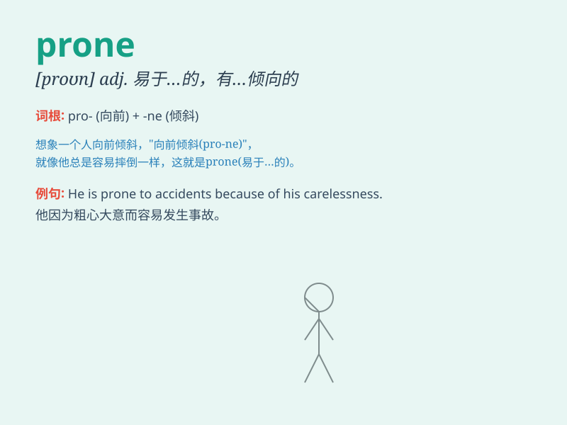

## prone

**英音:** _[prəʊn]_ **美音:** _[pron]_

**译义:** *adj.倾向于*

### 短语

+ **prone to:** _易于；有......倾向的_

+ **be prone to illness:** _容易生病_

+ **prone position:** _俯卧姿势_

+ **fall prone:** _向前跌倒；俯卧_

+ **prone area:** _易受灾地区；易发生问题的地区_

### 例句

#### 例句1

> **He is prone to making mistakes when he\'s tired.**

**中文翻译:** 当他疲倦时，他很容易犯错误。

**单词释义:** 易于；有...倾向的

#### 例句2

> **Some people are prone to getting colds in winter.**

**中文翻译:** 有些人在冬天容易感冒。

**单词释义:** 倾向于；容易

#### 例句3

> **The area is prone to floods during the rainy season.**

**中文翻译:** 该地区在雨季容易发生洪水。

**单词释义:** 常受...影响的；有...倾向的

### 背诵小故事

> 想象一下，有个叫小明的人，他总是
prone（易于）在下雨天滑倒，因为他走路不看路。每次下雨，他就像被施了魔法一样，特别容易摔跤。所以
prone 就是容易、易于的意思。

**想象一下，有个叫小明的人，他总是易于在下雨天滑倒，因为他走路不看路。每次下雨，他就像被施了魔法一样，特别容易摔跤。所以
prone 就是容易、易于的意思。**

### 图义

