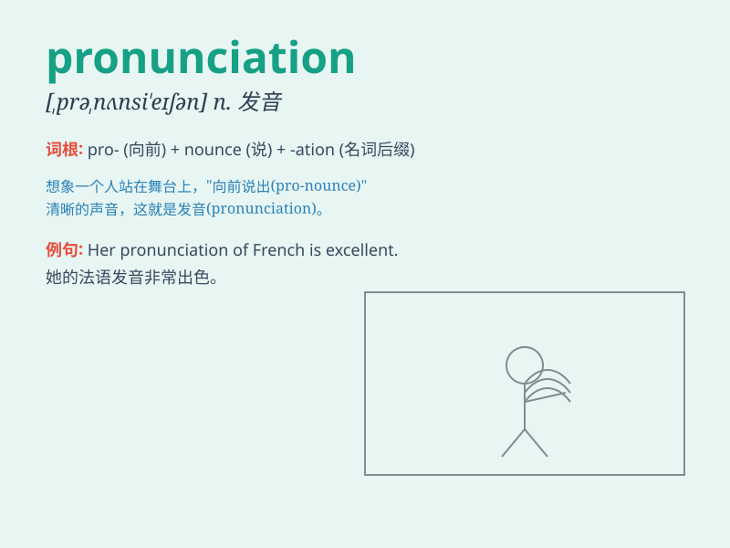

## pronunciation

**英音:** _[prə,nʌnsɪ\'eɪʃ(ə)n]_ **美音:**
_[prə,nʌnsɪ\'eʃən]_

**译义:** *n.发音,读法*

### 短语

+ **correct pronunciation:** _正确的发音_

+ **improve pronunciation:** _改善发音_

+ **poor pronunciation:** _糟糕的发音_

+ **native pronunciation:** _母语般的发音_

+ **standard pronunciation:** _标准发音_

### 例句

#### 例句1

> **She has a clear and accurate pronunciation.**

**中文翻译:** 她的发音清晰、准确。

**单词释义:** 发音

#### 例句2

> **The teacher corrected my pronunciation of this word.**

**中文翻译:** 老师纠正了我这个词的发音。

**单词释义:** 发音

#### 例句3

> **His pronunciation is influenced by his regional accent.**

**中文翻译:** 他的发音受到地方口音的影响。

**单词释义:** 发音

### 背诵小故事

> One day, a little ant was trying to learn the correct pronunciation
of words. It practiced hard but kept making mistakes. Finally, with
patience and effort, it mastered the pronunciation and could communicate
clearly. Remember, pronunciation is key to good communication!

**有一天，一只小蚂蚁试图学习单词的正确发音。它努力练习但一直犯错。最后，凭借耐心和努力，它掌握了发音，能够清晰地交流。记住，发音是良好交流的关键！**

### 图义

