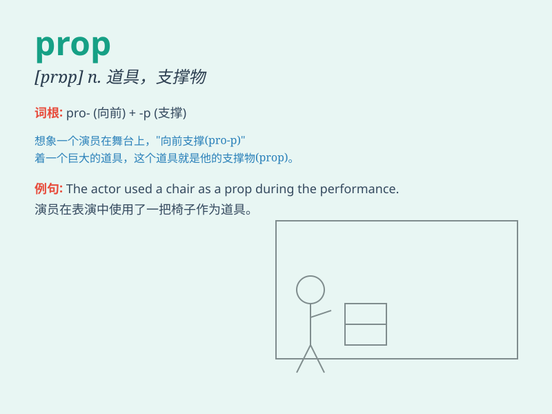

## prop

**英音:** _[prɒp]_ **美音:** _[prɑp]_

**译义:** *n.支持者,倚靠人,道具,螺旋桨vt.支撑,维持*

### 短语

+ **prop up:** _支撑；支持；撑起_

+ **prop open:** _撑开；支开_

+ **prop something against:** _把某物靠在......上_

+ **a theatrical prop:** _戏剧道具_

+ **prop forward:** _向前支撑_

### 例句

#### 例句1

> **He used a stick to prop the door open.**

**中文翻译:** 他用一根棍子把门撑开。

**单词释义:** 支撑；支住

#### 例句2

> **The government\'s new policy is seen as a prop for the
economy.**

**中文翻译:** 政府的新政策被视为对经济的支撑。

**单词释义:** 支撑物；支柱；支持

#### 例句3

> **She propped her chin on her hand and stared out of the
window.**

**中文翻译:** 她用手撑着下巴，凝视着窗外。

**单词释义:** 支撑；使倚靠

### 背诵小故事

> A brave actor was performing on the stage. Suddenly, the backdrop
started to fall. He quickly grabbed a prop, a long wooden stick, and
propped up the backdrop to save the show.

**一位勇敢的演员正在舞台上表演。突然，背景幕布开始掉落。他迅速抓住一个道具，一根长长的木棍，用它支撑住幕布拯救了演出。**

### 图义

