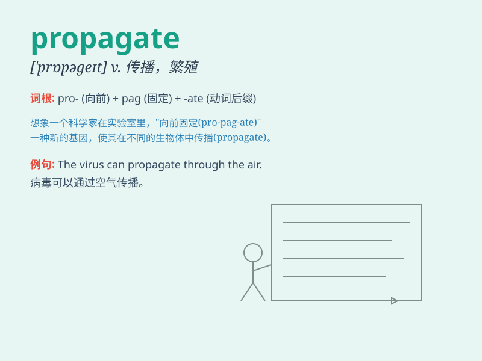

## propagate

**英音:** _[\'prɒpəgeɪt]_ **美音:** _[\'prɑpə\'get]_

**译义:** *v.繁殖,传播,宣传*

### 短语

+ **propagate knowledge:** _传播知识_

+ **propagate plants:** _繁殖植物_

+ **propagate rumors:** _散播谣言_

+ **propagate a belief:** _宣扬一种信仰_

+ **propagate the species:** _繁衍物种_

### 例句

#### 例句1

> **Plants propagate by seeds or cuttings.**

**中文翻译:** 植物通过种子或插条繁殖。

**单词释义:** 繁殖

#### 例句2

> **The Internet has helped to propagate information rapidly.**

**中文翻译:** 互联网有助于信息的快速传播。

**单词释义:** 传播

#### 例句3

> **They are trying to propagate their religious beliefs.**

**中文翻译:** 他们试图传播他们的宗教信仰。

**单词释义:** 传播；宣扬

### 背诵小故事

> A group of scientists were working hard to propagate a new plant
species. They carefully nurtured the seeds, ensuring they grew and
spread widely. Finally, their efforts paid off and the plants propagated
successfully all over the region.

**一群科学家努力去繁殖一种新的植物物种。他们精心培育种子，确保其生长和广泛传播。最终，他们的努力得到了回报，植物成功地在整个地区繁殖开来。**

### 图义

