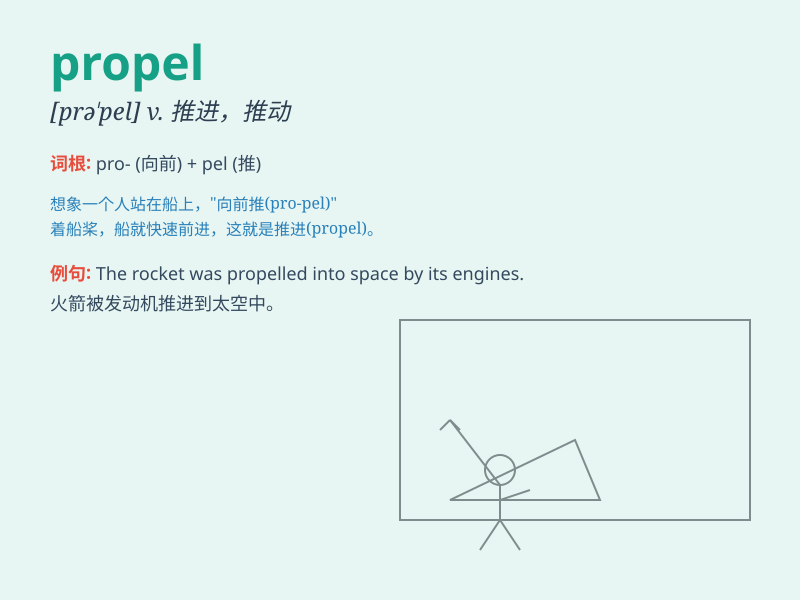

## propel

**英音:** _[prə\'pel]_ **美音:** _[prə\'pɛl]_

**译义:** *vt.推进,驱使*

### 短语

+ **propel forward:** _向前推进_

+ **propel oneself:** _推动自己_

+ **propel into:** _推进到；促使进入_

+ **be propelled by:** _被\...\...推动_

+ **propel through:** _推动穿过_

### 例句

#### 例句1

> **The new technology will propel the company forward.**

**中文翻译:** 新技术将推动公司向前发展。

**单词释义:** 推动；驱动

#### 例句2

> **He used his oars to propel the boat across the lake.**

**中文翻译:** 他用桨推动船穿过湖面。

**单词释义:** 推进；驱动

#### 例句3

> **Her ambition propelled her to great success.**

**中文翻译:** 她的野心促使她取得了巨大的成功。

**单词释义:** 促使；激励

### 背诵小故事

> A brave astronaut used a special device to propel himself through
space. The force from the device pushed him forward, helping him reach
his destination. Just like that, \'propel\' means to drive or push
forward forcefully.

**一位勇敢的宇航员使用一种特殊装置来推动自己在太空中前进。装置产生的力量将他向前推，帮助他到达目的地。就像这样，\'propel\'意思是用力推动或驱使前进。**

### 图义

