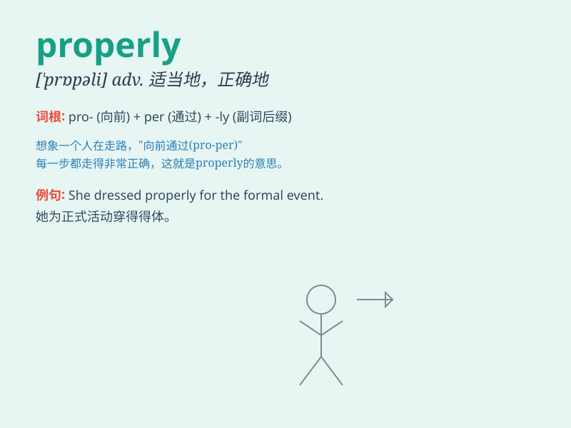

## properly

**英音:** _[\'prɒp(ə)lɪ]_ **美音:** _[\'prɑpɚli]_

**译义:** *adv.适当地,完全地*

### 短语

+ **behave properly:** _举止得体_

+ **do something properly:** _恰当地做某事_

+ **dress properly:** _穿着得体_

+ **speak properly:** _说话恰当_

+ **handle things properly:** _妥善处理事情_

### 例句

#### 例句1

> **You should dress properly for the interview.**

**中文翻译:** 面试时您应该着装得体。

**单词释义:** 适当地；正确地

#### 例句2

> **The machine is not working properly.**

**中文翻译:** 机器工作不正常。

**单词释义:** 正常地；恰当地

#### 例句3

> **He didn\'t behave properly at the party.**

**中文翻译:** 他在聚会上的行为不端正。

**单词释义:** 得体地；合适地

### 背诵小故事

> A little monkey wanted to build a treehouse. But at first, he did
everything randomly. Later, his friend told him to do it properly. So he
measured carefully, chose the right materials, and finally built a
wonderful treehouse.

**一只小猴子想要建造一个树屋。但起初，它做事很随意。后来，它的朋友告诉它要正确地做。于是它仔细测量，选对材料，最终建成了一个很棒的树屋。**

### 图义

