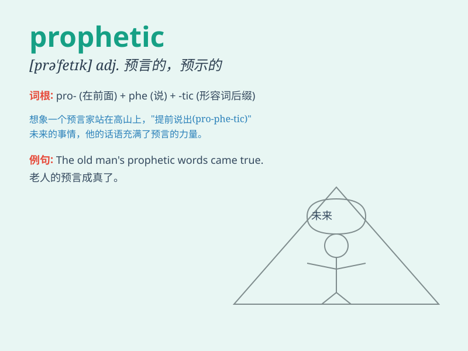

## prophetic

**英音:** _[prə\'fetɪk]_ **美音:** _[prə\'fɛtɪk]_

**译义:** *adj.预言的*

### 短语

+ **prophetic dream:** _预言性的梦_

+ **prophetic vision:** _预言性的幻象_

+ **prophetic warning:** _预言性的警告_

+ **prophetic statement:** _预言性的陈述_

+ **prophetic power:** _预言的能力_

### 例句

#### 例句1

> **The old man\'s words had a prophetic tone, warning of an
impending disaster.**

**中文翻译:** 老人的话带着预言般的语气，警告灾难即将来临。

**单词释义:** 预言的；预示的

#### 例句2

> **Her dreams were often prophetic, giving her insights into future
events.**

**中文翻译:** 她的梦常常具有预言性，使她能够洞察未来的事件。

**单词释义:** 有预言能力的

#### 例句3

> **The novel has a prophetic element, imagining a world dominated by
technology.**

**中文翻译:** 小说带有预言元素，想象了一个由技术主导的世界。

**单词释义:** 预示的；预言性的

### 背诵小故事

> A wise old man in a small village had prophetic dreams. One night, he
dreamt of a big flood. His warning saved the villagers. His ability to
predict like this shows the meaning of \'prophetic\'.

**在一个小村庄里，有一位智慧的老人经常做有预言性的梦。一天晚上，他梦到了一场大洪水。他的警告拯救了村民。他这种预测的能力体现了\'prophetic\'的含义。**

### 图义

