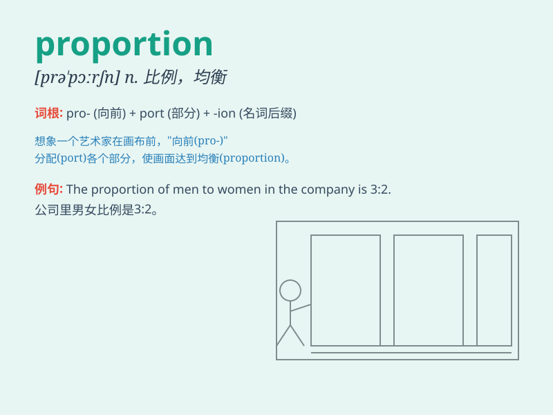

## proportion

**英音:** _[prə\'pɔːʃ(ə)n]_ **美音:** _[prə\'pɔrʃən]_

**译义:** *n.比例,均衡,面积,部分vt.使成比例,使均衡,分摊*

### 短语

+ **in proportion:** _成比例；相称_

+ **out of proportion:** _不成比例；不相称_

+ **proportion of:** _...的比例；...的部分_

+ **direct proportion:** _正比例_

+ **inverse proportion:** _反比例_

### 例句

#### 例句1

> **The proportion of men to women in the class is 2:3.**

**中文翻译:** 班级男女比例为2：3。

**单词释义:** 比例；份额

#### 例句2

> **A large proportion of the population is illiterate.**

**中文翻译:** 很大一部分人口是文盲。

**单词释义:** 比例；部分

#### 例句3

> **The proportion of mistakes in your work is quite high.**

**中文翻译:** 你的工作中犯错误的比例相当高。

**单词释义:** 比例；比率

### 背诵小故事

> A king needed to divide his treasure proportionally among his
knights. He carefully measured and calculated to ensure each knight got
a fair share. The word \'proportion\' means the relative size or amount
of something.

**一位国王需要按比例在他的骑士之间分配他的财宝。他仔细衡量和计算，以确保每个骑士都得到公平的份额。单词"proportion"意思是某物的相对大小或数量。**

### 图义

