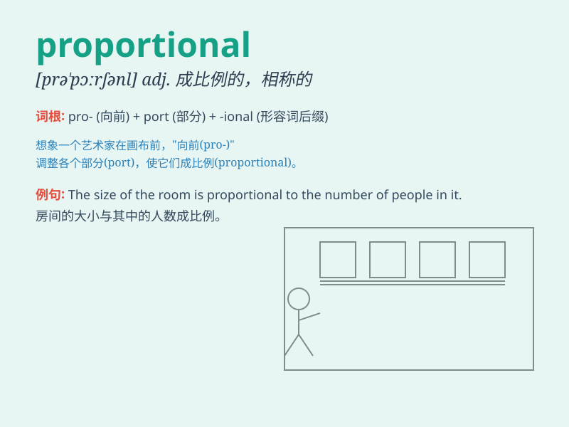

## proportional

**英音:** _[prə\'pɔːʃ(ə)n(ə)l]_ **美音:**
_[prə\'pɔrʃənl]_

**译义:** *adj.比例的,成比例的,相称的,均衡的*

### 短语

+ **proportional to:** _与\...成比例；与\...相称_

+ **proportional control:** _比例控制_

+ **proportional relationship:** _比例关系_

+ **proportional representation:** _比例代表制_

+ **proportional valve:** _比例阀_

### 例句

#### 例句1

> **The size of the reward should be proportional to the effort
made.**

**中文翻译:** 奖励的大小应该与付出的努力成正比。

**单词释义:** 成比例的；相称的

#### 例句2

> **The number of accidents is proportional to the speed of
driving.**

**中文翻译:** 事故的发生次数与驾驶速度成正比。

**单词释义:** 成比例的；相应的

#### 例句3

> **Salary is proportional to years of experience.**

**中文翻译:** 薪资与年资成正比。

**单词释义:** 成比例的；与...相称的

### 背诵小故事

> A king wanted to divide his land proportionally among his sons. But
they argued. Finally, a wise advisor came and used math to make the
division fair and proportional. Everyone was happy.

**一位国王想按比例把他的土地分给儿子们。但他们争论不休。最后，一位聪明的顾问用数学方法公平且成比例地进行了分配。大家都很高兴。**

### 图义

