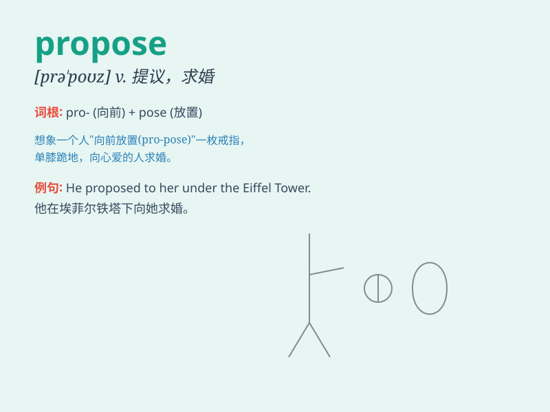

## propose

**英音:** _[prə\'pəʊz]_ **美音:** _[prə\'poz]_

**译义:** *vt.计划,建议,向\...提议,求(婚)vi.打算,求婚*

### 短语

+ **propose a plan:** _提出一个计划_

+ **propose marriage:** _求婚_

+ **propose an idea:** _提出一个想法_

+ **propose a solution:** _提出一个解决方案_

+ **propose a motion:** _提出一项动议_

### 例句

#### 例句1

> **He proposed a new plan to solve the problem.**

**中文翻译:** 他提出了一个新的计划来解决这个问题。

**单词释义:** 提出

#### 例句2

> **She proposed marriage to him last night.**

**中文翻译:** 昨晚她向他求婚了。

**单词释义:** 求婚

#### 例句3

> **The committee proposed that the meeting be postponed.**

**中文翻译:** 委员会提议推迟会议。

**单词释义:** 提议

### 背诵小故事

> A brave boy decided to propose to his girlfriend. He prepared a
beautiful ring and went to a romantic place. With a nervous heart, he
expressed his love and the wish to spend a lifetime together.

**一个勇敢的男孩决定向他的女朋友求婚。他准备了一枚漂亮的戒指，去了一个浪漫的地方。怀着紧张的心，他表达了他的爱和共度一生的愿望。**

### 图义

