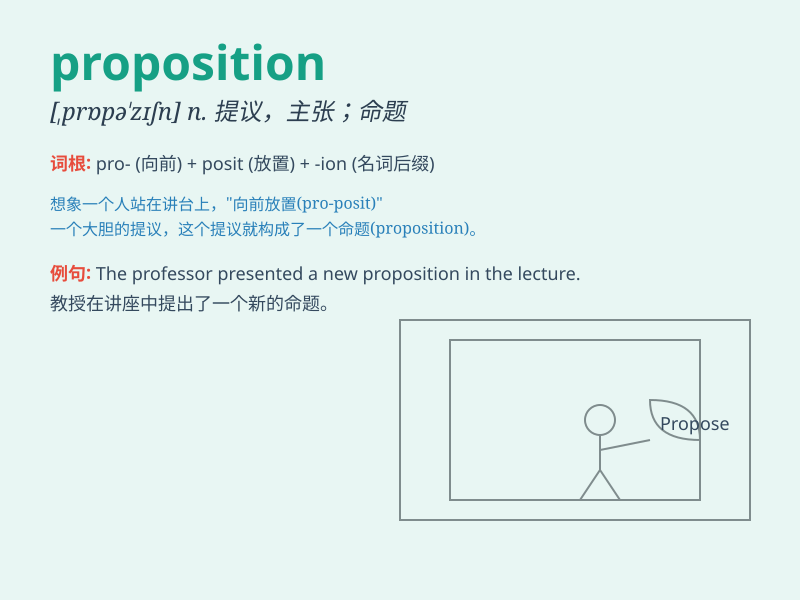

## proposition

**英音:** _[prɒpə\'zɪʃ(ə)n]_ **美音:** _[,prɑpə\'zɪʃən]_

**译义:** *n.主张,建议,陈述,命题*

### 短语

+ **make a proposition:** _提出建议；求婚_

+ **reject a proposition:** _拒绝一个提议_

+ **put forward a proposition:** _提出一个主张_

+ **accept a proposition:** _接受一个提议_

+ **consider a proposition:** _考虑一个提议_

### 例句

#### 例句1

> **The company received a lucrative proposition to merge with a
rival firm.**

**中文翻译:** 该公司收到了与竞争对手公司合并的有利提议。

**单词释义:** 提议；建议

#### 例句2

> **His proposition that we should all work harder was met with some
resistance.**

**中文翻译:** 他提出的我们都应该更加努力工作的建议遭到了一些抵制。

**单词释义:** 主张；观点

#### 例句3

> **She considered the proposition carefully before making a
decision.**

**中文翻译:** 她在做出决定之前仔细考虑了这个提议。

**单词释义:** 提议；建议

### 背诵小故事

> A detective was faced with a proposition: find the stolen jewels or
the criminal would escape. The proposition was a difficult challenge,
but he was determined to solve it.

**一位侦探面临一个提议：找到被盗的珠宝，否则罪犯就会逃跑。这个提议是一个艰难的挑战，但他决心解决它。**

### 图义

