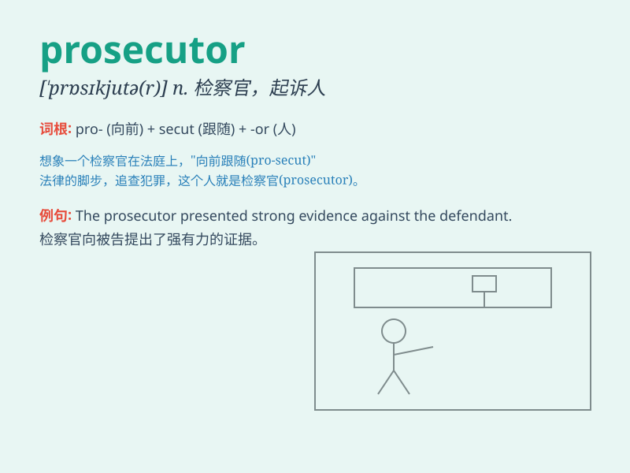

## prosecutor

**英音:** _[\'prɒsɪkjuːtə]_ **美音:** _[\'prɑsɪ\'kjʊtɚ]_

**译义:** *n.检举人*

### 短语

+ **public prosecutor:** _公诉人；检察官_

+ **chief prosecutor:** _首席检察官_

+ **prosecutor general:** _检察长_

+ **district prosecutor:** _地区检察官_

+ **junior prosecutor:** _初级检察官_

### 例句

#### 例句1

> **The prosecutor presented compelling evidence in court.**

**中文翻译:** 检察官在法庭上提供了令人信服的证据。

**单词释义:** 检察官

#### 例句2

> **The prosecutor is determined to seek justice in this case.**

**中文翻译:** 检察官决心为此案伸张正义。

**单词释义:** 检察官

#### 例句3

> **The prosecutor\'s questioning was sharp and to the point.**

**中文翻译:** 检察官的提问十分尖锐、切中要害。

**单词释义:** 检察官

### 背诵小故事

> A brave prosecutor was determined to seek justice. One day, he found
crucial evidence and fought hard in court to convict the criminal. His
persistence led to a fair outcome.

**一位勇敢的检察官决心寻求正义。有一天，他找到了关键证据，并在法庭上奋力指控罪犯。他的坚持带来了公正的结果。**

### 图义

