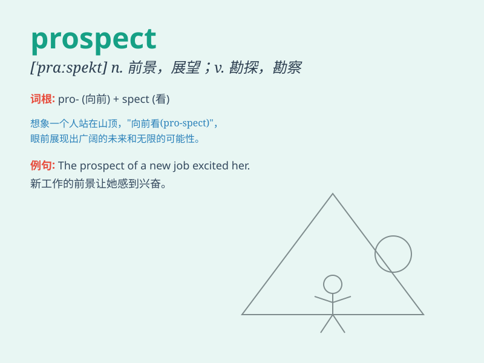

## prospect

**英音:** _[\'prɒspekt]_ **美音:** _[\'prɑspɛkt]_

**译义:** *n.景色,前景,前途,期望vi.寻找,勘探*

### 短语

+ **prospect for:** _勘探；寻找_

+ **in prospect:** _可期待；在望；有希望_

+ **bright prospect:** _光明的前景_

+ **career prospect:** _职业前景_

+ **prospect of success:** _成功的可能性_

### 例句

#### 例句1

> **The prospect of a long and difficult journey ahead filled them
with dread.**

**中文翻译:** 一想到接下来的漫长而艰难的旅程，他们就充满了恐惧。

**单词释义:** 前景；可能性

#### 例句2

> **He is excited about the prospect of getting a promotion.**

**中文翻译:** 他对升职的前景感到兴奋。

**单词释义:** 前景；可能性

#### 例句3

> **The company is exploring new prospects for business
expansion.**

**中文翻译:** 公司正在探索业务拓展的新前景。

**单词释义:** 前景；可能性

### 背诵小故事

> A young adventurer was lost in the forest. But when he climbed to the
top of a hill, he saw a beautiful prospect - a wide valley and a
peaceful village. The view gave him hope and a new direction.

**一位年轻的冒险家在森林中迷路了。但当他爬到山顶时，他看到了一个美丽的景象------一个宽阔的山谷和一个宁静的村庄。这景色给了他希望和新的方向。**

### 图义

