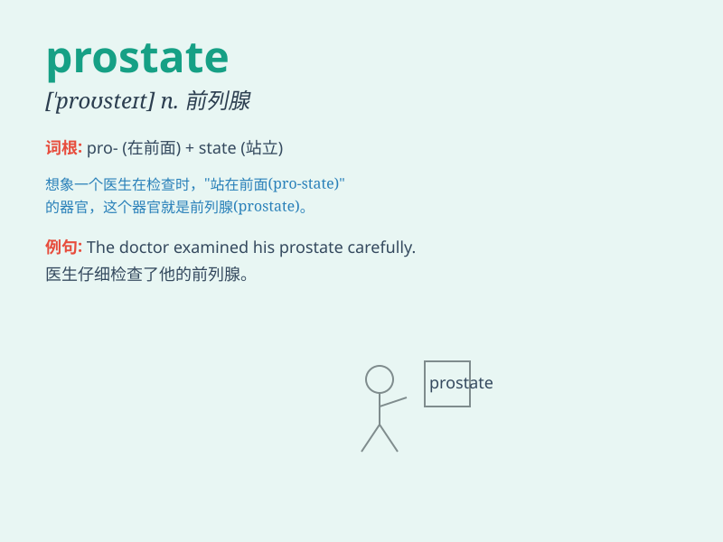

## prostate

**英音:** _[\'prɒsteɪt]_ **美音:** _[\'prɑstet]_

**译义:** *adj.前列腺的n.前列腺*

### 短语

+ **prostate cancer:** _前列腺癌_

+ **prostate gland:** _前列腺_

+ **prostate biopsy:** _前列腺活检_

+ **prostate examination:** _前列腺检查_

+ **prostate disorder:** _前列腺疾病_

### 例句

#### 例句1

> **The doctor examined his prostate.**

**中文翻译:** 医生检查了他的前列腺。

**单词释义:** 前列腺

#### 例句2

> **Prostate problems can affect a man\'s quality of life.**

**中文翻译:** 前列腺问题会影响男性的生活质量。

**单词释义:** 前列腺

#### 例句3

> **Regular check-ups are important for prostate health.**

**中文翻译:** 定期检查对前列腺健康很重要。

**单词释义:** 前列腺

### 背诵小故事

> A brave hero named Pro was always at the state\'s defense. One day,
he had a health issue related to his prostate. But with his
determination, he overcame it. Remember, prostate is related to a part
of the male body.

**一位名叫普罗的勇敢英雄总是保卫着国家。有一天，他的前列腺出现了健康问题。但凭借他的决心，他克服了困难。记住，prostate
是与男性身体的一部分有关。**

### 图义

