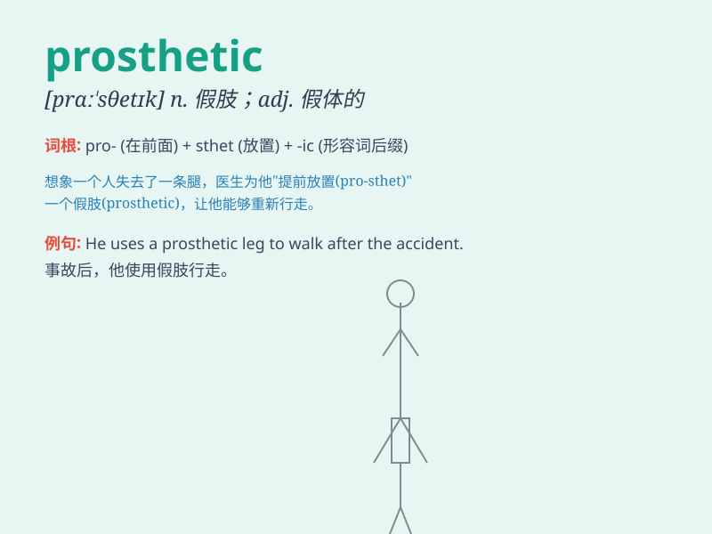

## prosthetic

**英音:** _[prɒsˈθetɪk]_ **美音:** _[prɑːsˈθetɪk]_

**译义:** *adj.假体的；义肢的；修复术的；非朊基的*

### 短语

+ **prosthetic device:** _假肢装置；假体设备_

+ **prosthetic limb:** _假肢_

+ **prosthetic dentistry:** _口腔修复学；假牙修复_

+ **prosthetic eye:** _假眼_

+ **prosthetic material:** _修复材料；假体材料_

### 例句

#### 例句1

> **The athlete was fitted with a prosthetic limb after the
accident.**

**中文翻译:** 这位运动员在事故后安装了假肢。

**单词释义:** 假肢的；假体的

#### 例句2

> **She received a prosthetic eye to improve her appearance.**

**中文翻译:** 她接受了一只假眼来改善外观。

**单词释义:** 假的；人造的

#### 例句3

> **The prosthetic device helped him regain some mobility.**

**中文翻译:** 这个假体装置帮助他重新获得了一些活动能力。

**单词释义:** 假体的；修复的

### 背诵小故事

> A brave soldier lost his leg in battle. But with a prosthetic limb,
he was able to walk again and continue his duties. The prosthetic gave
him new hope and strength.

**一位勇敢的士兵在战斗中失去了腿。但凭借假肢，他能够再次行走并继续履行职责。假肢给了他新的希望和力量。**

### 图义

