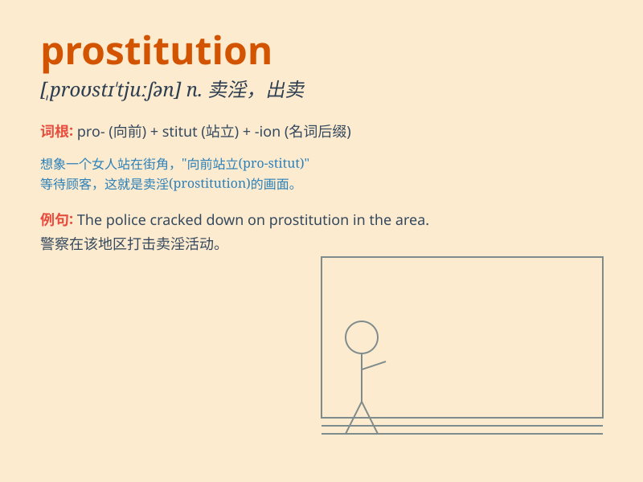

## prostitution

**英音:** _[,prɒstɪ\'tʃuːʃn ; ,prɒstɪ\'tjuːʃn]_ **美音:**
_[\'prɑstə\'tʊʃən]_

**译义:** *n.卖淫,堕落,滥用,糟蹋*

### 短语

+ **prostitution ring:** _卖淫团伙_

+ **prostitution business:** _卖淫生意_

+ **illegal prostitution:** _非法卖淫_

+ **street prostitution:** _街头卖淫_

+ **organized prostitution:** _有组织的卖淫_

### 例句

#### 例句1

> **Prostitution is illegal in many countries.**

**中文翻译:** 卖淫在许多国家都是非法的。

**单词释义:** 卖淫

#### 例句2

> **She was forced into prostitution by poverty.**

**中文翻译:** 她因贫困被迫卖淫。

**单词释义:** 卖淫

#### 例句3

> **The police are cracking down on prostitution in the area.**

**中文翻译:** 警方正在打击该地区的卖淫活动。

**单词释义:** 卖淫

### 背诵小故事

> A poor girl was tricked into prostitution. She was very sad and
wanted to escape this bad situation. One day, a kind person helped her
get out and start a new life. Remember, prostitution is a bad thing.

**一个可怜的女孩被骗入了卖淫行业。她非常伤心，想要逃离这种糟糕的状况。有一天，一个善良的人帮助她摆脱并开始了新的生活。记住，卖淫是不好的。**

### 图义

