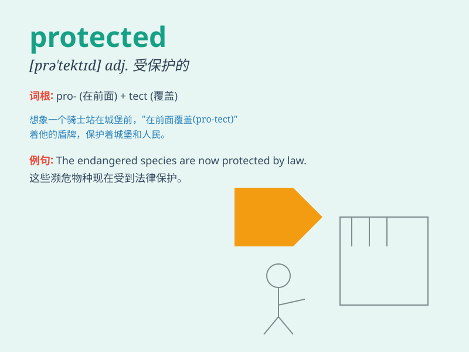

## protected

**英音:** _[prəˈtɛktɪd]_ **美音:** _[proʊˈtɛktɪd]_

**译义:** *adj.受保护的；受限制的；有版权的*

### 短语

+ **protected area:** _保护区_

+ **protected species:** _受保护物种_

+ **protected mode:** _保护模式_

+ **be protected from:** _被保护免受\...\..._

+ **protected environment:** _受保护的环境_

### 例句

#### 例句1

> **The protected area is home to many rare species.**

**中文翻译:** 这个受保护的区域是许多稀有物种的家园。

**单词释义:** 受保护的

#### 例句2

> **The document is protected by a password.**

**中文翻译:** 这份文件被密码保护着。

**单词释义:** 被保护的

#### 例句3

> **She wore a protected suit during the experiment.**

**中文翻译:** 在实验期间，她穿着一套防护套装。

**单词释义:** 防护的

### 背诵小故事

> A little prince was protected by a magical shield. The shield made
sure no harm could come to him. Just like the prince, when something is
\'protected\', it is safe and shielded from danger.

**一个小王子被一个神奇的护盾保护着。这个护盾确保他不会受到任何伤害。就像小王子一样，当某物被\'protected\'时，它是安全的，免受危险。**

### 图义

