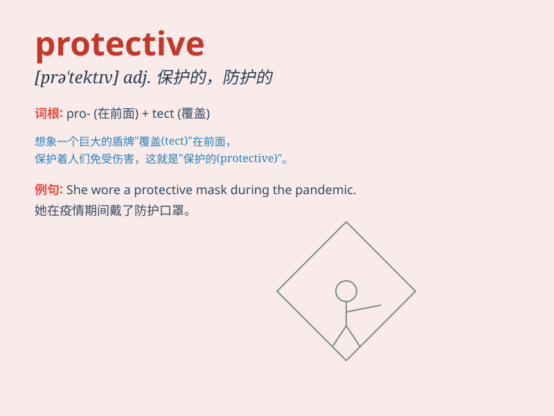

## protective

**英音:** _[prə\'tektɪv]_ **美音:** _[prə\'tɛktɪv]_

**译义:** *adj.给予保护的,保护的*

### 短语

+ **protective clothing:** _防护服_

+ **protective measure:** _保护措施_

+ **protective film:** _保护膜_

+ **protective gear:** _防护装备_

+ **protective instinct:** _保护本能_

### 例句

#### 例句1

> **He is very protective of his younger sister.**

**中文翻译:** 他非常保护他的妹妹。

**单词释义:** 保护的；防护的

#### 例句2

> **The mother hen is protective of her chicks.**

**中文翻译:** 母鸡保护她的小鸡。

**单词释义:** 保护的；呵护的

#### 例句3

> **She wore protective clothing when working in the laboratory.**

**中文翻译:** 她在实验室工作时穿着防护服。

**单词释义:** 防护的；保护性的

### 背诵小故事

> One day, a little bird was in danger. But its mother spread her wings
in a protective way to shield it from harm. Just like a mother\'s love,
\'protective\' means keeping someone or something safe from danger or
harm.

**有一天，一只小鸟处于危险之中。但它的妈妈以保护的姿态展开翅膀来保护它免受伤害。就像妈妈的爱一样，'protective'意思是使某人或某物安全，免受危险或伤害。**

### 图义

