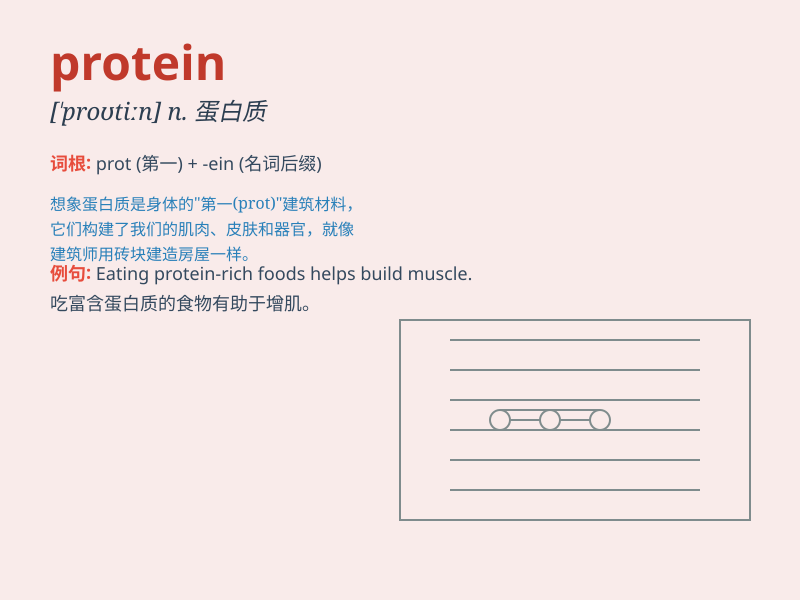

## protein

**英音:** _[\'prəʊtiːn]_ **美音:** _[\'protin]_

**译义:** *n.[生化]蛋白质adj.蛋白质的*

### 短语

+ **protein shake:** _蛋白质奶昔_

+ **protein synthesis:** _蛋白质合成_

+ **high protein diet:** _高蛋白饮食_

+ **protein powder:** _蛋白粉_

+ **plant protein:** _植物蛋白_

### 例句

#### 例句1

> **Eggs are a good source of protein.**

**中文翻译:** 鸡蛋是蛋白质的良好来源。

**单词释义:** 蛋白质

#### 例句2

> **The athlete increased his protein intake to build muscle.**

**中文翻译:** 该运动员增加了蛋白质摄入量以增强肌肉。

**单词释义:** 蛋白质

#### 例句3

> **Protein shakes are popular among fitness enthusiasts.**

**中文翻译:** 蛋白质奶昔深受健身爱好者的欢迎。

**单词释义:** 蛋白质

### 背诵小故事

>
想象一下，你是一位超级英雄，每次打败怪兽后，都需要吃一种叫\'protein\'的神奇食物来补充能量，让自己变得更强壮。它就像你的力量之源，能帮你修复身体，增长肌肉。

**想象你是超级英雄，打败怪兽后靠吃叫'蛋白质'的神奇食物补充能量、变强壮，它是力量之源，能修复身体、增长肌肉。**

### 图义

