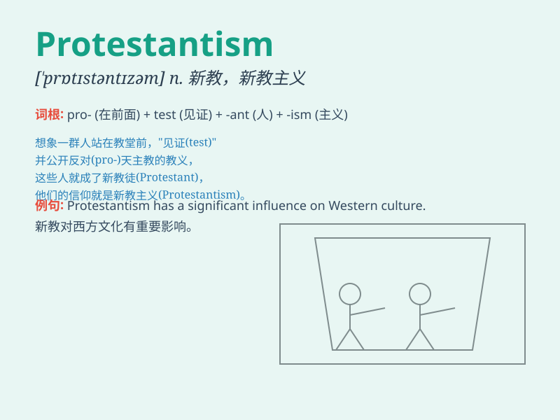

## Protestantism

**英音:** _[ˈprɒtɪstəntɪzəm]_ **美音:**
_[ˈprɑːtɪstəntɪzəm]_

**译义:** *n.
新教，新教主义（基督教的一派，与天主教、东正教并立）*

### 短语

+ **Protestantism theology:** _新教神学_

+ **Protestantism church:** _新教教会_

+ **Protestantism movement:** _新教运动_

+ **Protestantism belief:** _新教信仰_

+ **Protestantism doctrine:** _新教教义_

### 例句

#### 例句1

> **Protestantism has had a significant influence on Western
culture.**

**中文翻译:** 新教对西方文化产生了重大影响。

**单词释义:** 新教（指 16 世纪脱离罗马天主教的各教派）

#### 例句2

> **The spread of Protestantism led to various social changes.**

**中文翻译:** 新教的传播导致了各种社会变化。

**单词释义:** 新教

#### 例句3

> **He converted to Protestantism in his early years.**

**中文翻译:** 他早年皈依了新教。

**单词释义:** 新教

### 背诵小故事

>
从前有个小镇，人们对传统宗教的一些做法不满，于是发起抗议并形成新的信仰，这种新的信仰体系就被称为Protestantism，即新教。

**从前有个小镇，人们因不满传统宗教的做法而发起抗议形成的新信仰体系被称为新教。**

### 图义

