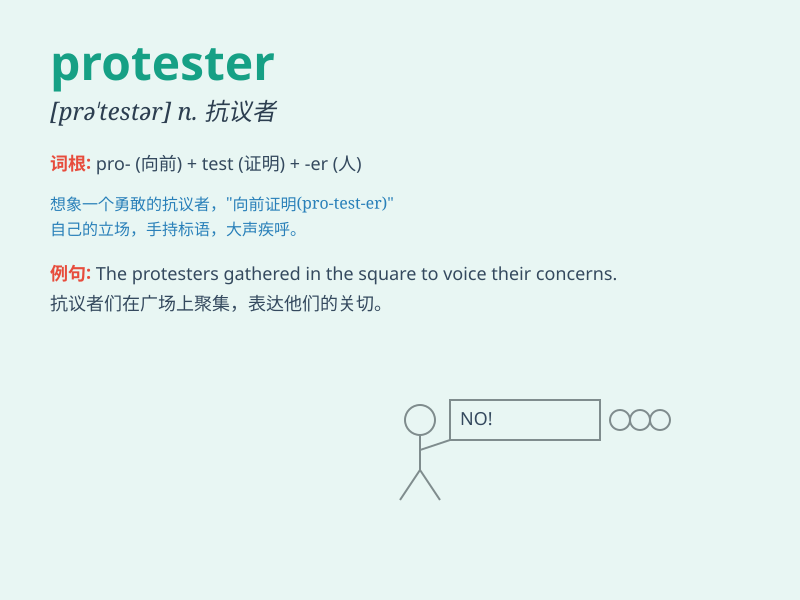

## protester

**英音:** _[prəˈtestə]_ **美音:** _[proʊˈtɛstər]_

**译义:** *n.抗议者，反对者；示威者*

### 短语

+ **peaceful protester:** _和平抗议者_

+ **angry protester:** _愤怒的抗议者_

+ **violent protester:** _暴力抗议者_

+ **anti-government protester:** _反政府抗议者_

+ **environmental protester:** _环保抗议者_

### 例句

#### 例句1

> **The protesters marched through the city streets demanding
justice.**

**中文翻译:** 抗议者在城市街道上游行，要求正义。

**单词释义:** 抗议者

#### 例句2

> **The police tried to control the angry protesters.**

**中文翻译:** 警察试图控制愤怒的抗议者。

**单词释义:** 抗议者

#### 例句3

> **A group of protesters gathered outside the government
building.**

**中文翻译:** 一群抗议者聚集在政府大楼外。

**单词释义:** 抗议者

### 背诵小故事

> One day, a group of people were marching in the street. They were
protesters who were unhappy with a new law. They held signs and shouted
loudly to make their voices heard. Their goal was to bring about change.

**一天，一群人在街上游行。他们是抗议者，对一项新法律感到不满。他们举着标语牌，大声呼喊，让自己的声音被听到。他们的目标是带来改变。**

### 图义

