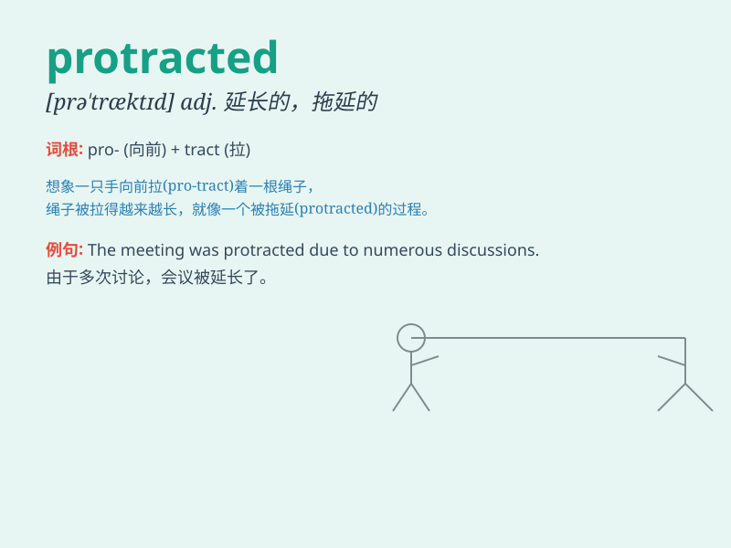

## protracted

**英音:** _[prə\'træktɪd]_ **美音:** _[prə\'træktɪd]_

**译义:** *adj.拖延的*

### 短语

+ **protracted illness:** _长期的疾病_

+ **protracted conflict:** _持久的冲突_

+ **protracted negotiation:** _旷日持久的谈判_

+ **protracted process:** _漫长的过程_

+ **protracted war:** _长期的战争_

### 例句

#### 例句1

> **The protracted negotiations between the two companies finally
reached a conclusion.**

**中文翻译:** 两家公司旷日持久的谈判终于有了结果。

**单词释义:** 漫长的

#### 例句2

> **She suffered from a protracted illness that lasted for several
months.**

**中文翻译:** 她患有持续数月的慢性疾病。

**单词释义:** 持久的；拖延的

#### 例句3

> **The war was a protracted and bloody conflict.**

**中文翻译:** 战争是一场旷日持久、血腥的冲突。

**单词释义:** 长期的

### 背诵小故事

> A brave explorer was on a protracted journey. He faced many
difficulties and spent a long time in the wild. But his determination
kept him going. Finally, he completed the adventure. \'Protracted\' here
means lasting for a long time and drawn out.

**一位勇敢的探险家正在进行一次漫长的旅程。他面临许多困难，在野外度过了很长时间。但他的决心让他坚持下去。最后，他完成了这次冒险。'protracted'在这里指的是持续很长时间、拖延的。**

### 图义

